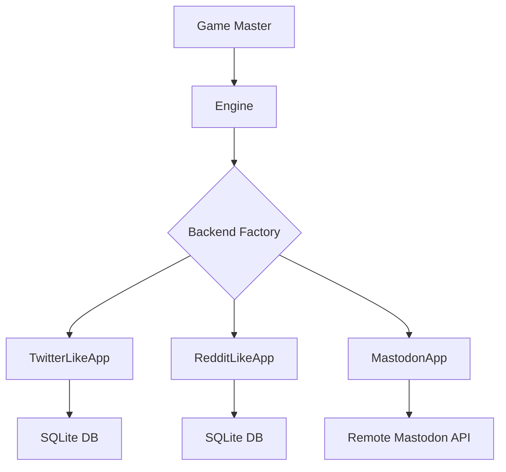

# Social Media Backends

The simulation supports three social media platform backends. Each implements
the same abstract interface, so agent logic is platform-agnostic.

## Backend Selection

Set the backend in your Hydra config:

```sh
# CLI override
uv run mastodon-sim env=twitter_like   # default
uv run mastodon-sim env=reddit_like
uv run mastodon-sim env=mastodon
```

Or in `config.yaml`:

```yaml
defaults:
    - env: reddit_like
```

---

## Twitter-like (Local)

A local SQLite-based backend that simulates a Twitter/X-like platform.

**Actions**: `POST`, `REPLY`, `REPOST`, `LIKE`

**Character limit**: 280

**Config**: `env/twitter_like.yaml`

```yaml
platform_type: twitter_like
use_server: false
```

Features:

- User timelines (posts from followed accounts)
- Threaded replies
- Repost/retweet mechanics
- Like/favorite system
- Follow/unfollow relationship management
- All data stored in a local SQLite database (no external server needed)

---

## Reddit-like (Local)

A local SQLite-based backend that simulates a Reddit-like platform.

**Actions**: `POST`, `COMMENT`, `UPVOTE`, `DOWNVOTE`

**Config**: `env/reddit_like.yaml`

```yaml
platform_type: reddit_like
use_server: false
```

Features:

- Subreddit-based content organization
- Threaded comments with nesting
- Score-based voting (upvotes and downvotes)
- Subreddit membership management
- Local SQLite storage

---

## Mastodon (Remote)

Connects to a real Mastodon instance via its API.

**Actions**: `POST`, `REPLY`, `BOOST`, `LIKE`

**Character limit**: 500 (toots)

**Config**: `env/mastodon.yaml`

```yaml
platform_type: mastodon
use_server: true
```

Requires environment variables in `.env`:

```dotenv
API_BASE_URL=https://your-mastodon-instance.social
MASTODON_CLIENT_ID=your_client_id
MASTODON_CLIENT_SECRET=your_client_secret
EMAIL_PREFIX=user_email_prefix
USER001_PASSWORD=password_for_user_001
```

See the [infrastructure/](https://github.com/social-sandbox/mastodon-sim/tree/main/infrastructure)
directory for instructions on deploying your own Mastodon instance.

---

## Backend Architecture

All backends implement a common interface defined in
`mastodon_sim.environments.backends.base`:



The engine translates between Concordia's action/observation model and the
platform-specific API. Each backend handles:

- **`initialize()`**: Create users, set up follow network from social_network config
- **`post()`**: Create new content
- **`reply()`**: Respond to existing content
- **`repost()`** / **`boost()`**: Share existing content
- **`like()`** / **`upvote()`**: React to content
- **`get_timeline()`**: Retrieve content for an agent's observation

### Responsibility Boundary

- Engine (`BaseRuntimeEngine` / `FlowRuntimeEngine`): episode loop, actor concurrency, probe timing
- GM (`GameMaster` + `SMAct`): timeline observation, action parsing, dispatch
- Backend app (`SocialMediaApp` implementation): platform state transitions,
  timeline retrieval/formatting, persistence

When changing platform behavior (feeds, post/reply semantics, vote rules), make
those changes in the backend first. When changing action grammar or dispatch,
change GM components. When changing who acts and how often, change the engine.

---

## Built-in Visualizers

Both local backends include a web-based visualizer (read-only frontend) for
inspecting simulation state during or after a run.

### Twitter-like Visualizer

```sh
TWITTER_LIKE_DB=path/to/twitter_like.db \
  python -m mastodon_sim.environments.backends.twitter_like.visualizer.server
```

Opens at `http://localhost:8002`. Features:

- **Global timeline**: All posts in reverse-chronological order with infinite scroll
- **Post detail + thread view**: Click any post to see the full reply thread with nested indentation
- **User profiles**: Click any username to see their bio, follower/following counts, and post history
- **Followers / following lists**: Navigate between connected users
- **User search**: Search for users by name
- **Admin overview**: Platform-wide stats (users, posts, replies, likes, reposts, follows), top users, most liked posts

### Reddit-like Visualizer

```sh
REDDIT_LIKE_DB=path/to/reddit_like.db \
  python -m mastodon_sim.environments.backends.reddit_like.visualizer.server
```

Opens at `http://localhost:8001`. Features:

- **New / Popular feeds**: Browse posts by recency or score
- **Subreddit views**: Click any subreddit to see its posts and community info
- **Post detail + comments**: Click any post to see full content with threaded comments
- **User profiles**: Karma, bio, and post history
- **Subreddit discovery**: Sidebar lists all communities with member counts
- **Admin overview**: Platform-wide stats, top users, top subreddits, highest-scoring posts

---

## Adding a New Backend (Developer Guide)

To implement a new social media platform:

1. **Create a package** under `environments/backends/your_platform/`
2. **Subclass `SocialMediaApp`** from `environments.backends.base`:

    ```python
    from mastodon_sim.environments.backends.base import SocialMediaApp, app_action

    class YourPlatformApp(SocialMediaApp):
        def initialize(self, users, following_network, seed_posts, ...):
            # Set up users, relationships, seed content
            ...

        @app_action
        def post(self, username: str, content: str) -> str:
            """Create a new post."""
            ...

        @app_action(selectable_name="reply_post", description="Reply to an existing post")
        def reply(self, username: str, post_id: int, content: str) -> str:
            """Reply to an existing post."""
            ...

        def get_timeline(self, username: str, limit: int = 10) -> list:
            ...

        def format_timeline_for_observation(self, username, timeline) -> str:
            ...
    ```

3. **Register in the factory** (`environments/backends/factory.py`):

    ```python
    elif platform_type == "your_platform":
        from .your_platform.app import YourPlatformApp
        return YourPlatformApp(db_path=db_path)
    ```

4. **Create a config** at `conf/env/your_platform.yaml`:

    ```yaml
    platform_type: your_platform
    use_server: false
    ```

The `@app_action` decorator auto-registers methods as available actions. The
`generic` action mode and `tool_calling` resolve mode will automatically
discover and use your decorated methods.

Action metadata notes:

- By default, the selectable action name is the Python function name.
- Backend authors can optionally provide `selectable_name` and `description`
    via `@app_action(...)` to expose more LLM-friendly names/descriptions.
- Simulation-level action filtering (`env.enabled_actions`) accepts either the
    canonical function name or the selectable alias.
- Fixed-action entity sets can also reference either canonical names or aliases.

### High-Value Customization Tasks

- Add new app actions (for example `bookmark`, `quote`, `join_subreddit`)
- Change timeline ranking and filtering logic
- Change storage model and query performance strategy
- Add domain-specific validation on action execution
