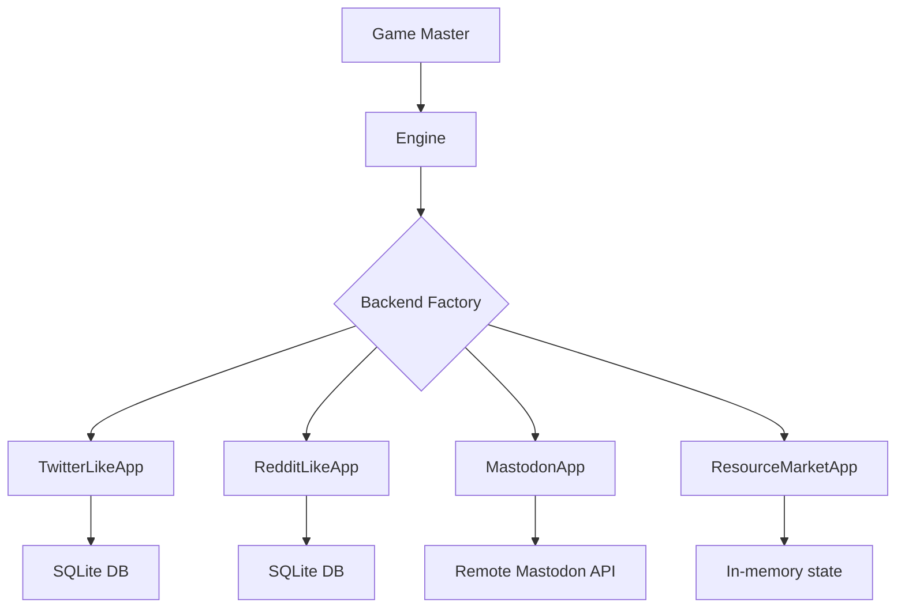

# Environment Backends

The simulation supports generic environment backends plus social-media
specializations. Each backend implements `EnvironmentApp`, so agent logic stays
platform-agnostic and executable actions are discovered from `@app_action`
methods.

## Backend Selection

Set the backend in your Hydra config:

```sh
# CLI override
uv run silisocs env=twitter_like   # default
uv run silisocs env=reddit_like
uv run silisocs env=mastodon
uv run silisocs scenario=resource_market agents=resource_market env=resource_market
```

Or in the top-level Hydra defaults:

```yaml
defaults:
    - env: reddit_like
```

The Mastodon backend requires the optional dependency extra:

```sh
pip install "silisocs[mastodon]"
```

---

## Generic Resource Market (Local)

A minimal in-memory non-social backend that demonstrates the generic
`EnvironmentApp` contract.

**Actions**: `INSPECT_MARKET`, `PRODUCE_RESOURCE`, `LIST_RESOURCE`,
`BUY_LISTING`, `CONSUME_RESOURCE`, `FINISHED`

**Config**: `env/resource_market.yaml`

```yaml
platform_type: resource_market
app:
  params:
    initial_cash: 20
    initial_inventory:
      food: 1
      wood: 0
      ore: 0
```

Features:

- Cash, inventory, open listings, and recent market events
- Generic observations through `EnvironmentApp.observe(...)`
- Tool-calling and generic-action resolution through `@app_action`
- No social network, timeline, feed, or recommendation requirement

---

## Twitter-like (Local)

A local SQLite-based backend that simulates a Twitter/X-like platform.

**Actions**: `POST`, `REPLY`, `REPOST`, `LIKE`

**Character limit**: 280

**Config**: `env/twitter_like.yaml`

```yaml
platform_type: twitter_like
use_server: false
```

Features:

- User timelines (posts from followed accounts)
- Threaded replies
- Repost/retweet mechanics
- Like/favorite system
- Follow/unfollow relationship management
- All data stored in a local SQLite database (no external server needed)

---

## Reddit-like (Local)

A local SQLite-based backend that simulates a Reddit-like platform.

**Actions**: `POST`, `COMMENT`, `UPVOTE`, `DOWNVOTE`

**Config**: `env/reddit_like.yaml`

```yaml
platform_type: reddit_like
use_server: false
```

Features:

- Subreddit-based content organization
- Threaded comments with nesting
- Score-based voting (upvotes and downvotes)
- Subreddit membership management
- Local SQLite storage

---

## Mastodon (Remote)

Connects to a real Mastodon instance via its API.

**Actions**: `POST`, `REPLY`, `BOOST`, `LIKE`

**Character limit**: 500 (toots)

**Config**: `env/mastodon.yaml`

```yaml
platform_type: mastodon
use_server: true
```

Live server operations require environment variables in `.env`:

```dotenv
API_BASE_URL=https://your-mastodon-instance.social
MASTODON_CLIENT_ID=your_client_id
MASTODON_CLIENT_SECRET=your_client_secret
EMAIL_PREFIX=user_email_prefix
USER001_PASSWORD=password_for_user_001
```

For public-package and CI usage, `use_server: false` constructs the Mastodon
backend in dry-run mode. Dry-run mode is non-interactive, does not clear or
mutate a Mastodon server, and returns empty/mock timeline data while still
exercising the same `SocialMediaApp` action interface. Use this mode for tests,
documentation examples, and local development that should not require Mastodon
credentials.

See the [infrastructure/](https://github.com/social-sandbox/silisocs/tree/main/infrastructure)
directory for instructions on deploying your own Mastodon instance.

---

## Backend Architecture

All backends implement a common interface defined in
`silisocs.environments.backends.base`:



The GM translates between Concordia's action/observation model and the
environment-specific API. Each backend handles:

- **`initialize()`**: Create runtime state for the agent set
- **`@app_action` methods**: Execute domain actions selected by agents
- **`observe()`**: Return generic observations for non-social environments
- **Optional social methods**: `get_timeline()`, `get_timeline_mode()`,
  `format_timeline_for_observation()`, and `parse_and_resolve_action()`

### Responsibility Boundary

- Engine (`BaseRuntimeEngine` / `FlowRuntimeEngine`): episode loop, actor concurrency, probe timing
- GM (`GameMaster` + `SMAct`): timeline observation, action parsing, dispatch
- Backend app (`EnvironmentApp` implementation): environment state transitions,
  action execution, optional timeline retrieval/formatting, persistence

When changing platform behavior (feeds, post/reply semantics, vote rules), make
those changes in the backend first. When changing action grammar or dispatch,
change GM components. When changing who acts and how often, change the engine.

---

## Built-in Visualizers

Both local backends include a web-based visualizer (read-only frontend) for
inspecting simulation state during or after a run.

### Twitter-like Visualizer

```sh
TWITTER_LIKE_DB=path/to/twitter_like.db \
  python -m silisocs.environments.backends.twitter_like.visualizer.server
```

Opens at `http://localhost:8002`. Features:

- **Global timeline**: All posts in reverse-chronological order with infinite scroll
- **Post detail + thread view**: Click any post to see the full reply thread with nested indentation
- **User profiles**: Click any username to see their bio, follower/following counts, and post history
- **Followers / following lists**: Navigate between connected users
- **User search**: Search for users by name
- **Admin overview**: Platform-wide stats (users, posts, replies, likes, reposts, follows), top users, most liked posts

### Reddit-like Visualizer

```sh
REDDIT_LIKE_DB=path/to/reddit_like.db \
  python -m silisocs.environments.backends.reddit_like.visualizer.server
```

Opens at `http://localhost:8001`. Features:

- **New / Popular feeds**: Browse posts by recency or score
- **Subreddit views**: Click any subreddit to see its posts and community info
- **Post detail + comments**: Click any post to see full content with threaded comments
- **User profiles**: Karma, bio, and post history
- **Subreddit discovery**: Sidebar lists all communities with member counts
- **Admin overview**: Platform-wide stats, top users, top subreddits, highest-scoring posts

---

## Adding a New Backend (Developer Guide)

To implement a new generic environment:

1. **Create a package** under `environments/backends/your_platform/`
2. **Subclass `EnvironmentApp`** from `environments.backends.base`:

    ```python
    from silisocs.environments.backends.base import EnvironmentApp, app_action

    class YourPlatformApp(EnvironmentApp):
        def initialize(self, agent_names: list[str], **kwargs):
            # Set up domain state
            ...

        @app_action
        def act(self, current_user: str, value: int) -> str:
            """Execute a domain action."""
            ...

        def observe(self, actor_name: str, **kwargs) -> str:
            ...
    ```

    Use `SocialMediaApp` instead if your backend needs timelines, feed
    formatting, social action parsing, or recommendation updates.

3. **Configure the class path and params**:

    ```yaml
    platform_type: custom
    app:
      class_path: my_pkg.backends.YourPlatformApp
      params:
        some_setting: 1
    ```

    `params` are strict constructor arguments. Unknown keys fail early unless
    the app constructor accepts `**kwargs`.

4. **Optionally register as a built-in** in the factory if it should be
   selectable by `platform_type` alone:

    ```python
    elif platform_type == "your_platform":
        from .your_platform.app import YourPlatformApp
        return YourPlatformApp(db_path=db_path)
    ```

5. **Create a config** at `conf/env/your_platform.yaml`:

    ```yaml
    platform_type: your_platform
    use_server: false
    gm:
      components:
        observe:
          built_in: app_observation
    ```

The `@app_action` decorator auto-registers methods as available actions. The
`generic` action mode and `tool_calling` resolve mode will automatically
discover and use your decorated methods.

Action metadata notes:

- By default, the selectable action name is the Python function name.
- Backend authors can optionally provide `selectable_name` and `description`
    via `@app_action(...)` to expose more LLM-friendly names/descriptions.
- Simulation-level action filtering (`env.enabled_actions`) accepts either the
    canonical function name or the selectable alias.
- Fixed-action entity sets can also reference either canonical names or aliases.

### High-Value Customization Tasks

- Add new app actions (for example `bookmark`, `quote`, `join_subreddit`)
- Change timeline ranking and filtering logic
- Change storage model and query performance strategy
- Add domain-specific validation on action execution
