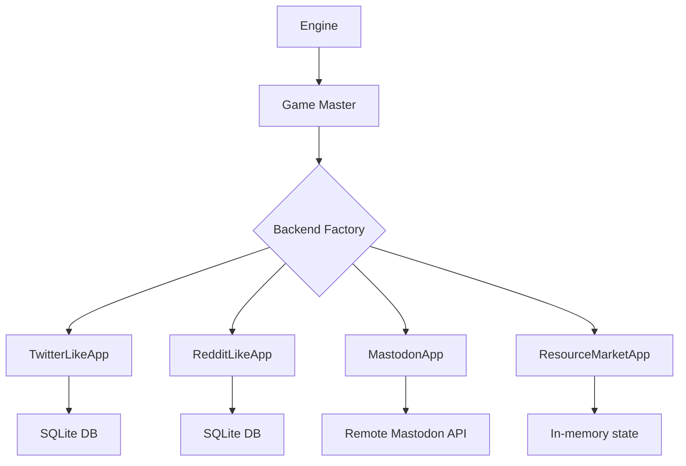

# Environment Backends

The simulation ships several peer environment backends. Each backend implements
`BackendApp`, so agent logic stays backend-agnostic and executable actions are
discovered from `@app_action` methods. Components that need extra capabilities
state those requirements explicitly, for example timeline and recommendation
components require the `SocialBackendApp` interface.

## Backend Selection

Set the backend in your Hydra config:

```sh
# CLI override
uv run silisocs env=twitter_like   # default
uv run silisocs env=reddit_like
uv run silisocs env=mastodon
uv run silisocs world=resource_market agents=resource_market env=resource_market
uv run silisocs world=virtual_space agents=virtual_space env=virtual_space
```

Curated external examples live under `scenarios/resource_market/` and
`scenarios/virtual_space/`:

```sh
uv run silisocs --config-path scenarios/resource_market/conf world=resource_market agents=resource_market env=resource_market
uv run silisocs --config-path scenarios/virtual_space/conf world=virtual_space agents=virtual_space env=virtual_space
```

Or in the top-level Hydra defaults:

```yaml
defaults:
    - env: reddit_like
```

The Mastodon backend requires the optional dependency extra:

```sh
pip install "silisocs[mastodon]"
```

---

## Resource Market (Local)

A small in-memory trade ecology where agents produce, list, transfer, buy, and
consume resources. Role-specific production and upkeep needs make exchange
useful even in short runs.

**Actions**: `INSPECT_MARKET`, `PRODUCE_RESOURCE`, `LIST_RESOURCE`,
`CANCEL_LISTING`, `BUY_LISTING`, `TRANSFER_RESOURCE`, `CONSUME_RESOURCE`,
`FINISHED`

**Config**: `env/resource_market.yaml`

```yaml
gm:
  backend:
    type: resource_market
    class_path: null
    params:
      initial_cash: 20
      initial_inventory:
        food: 1
        wood: 0
        ore: 0
      production_capabilities:
        farmer: {food: 2}
        woodworker: {wood: 2}
        miner: {ore: 2}
      role_needs:
        farmer: {wood: 1}
        woodworker: {food: 1}
        miner: {food: 1}
      upkeep_interval: 2
```

Features:

- Cash, inventory, role, satisfaction, open listings, and recent market events
- Role-specific production capabilities and upkeep needs
- Direct transfers and priced market listings
- Generic observations through `BackendApp.observe(...)`
- Tool-calling and generic-action resolution through `@app_action`

---

## Virtual Space (Local)

An in-memory room environment where agents move, talk, leave durable notes, and
work on configurable room tasks.

**Actions**: `LOOK`, `MOVE`, `LEAVE_NOTE`, `WORK_ON_TASK`, `TALK`, `FINISHED`

**Config**: `env/virtual_space.yaml`

```yaml
gm:
  backend:
    type: virtual_space
    class_path: null
    params:
      rooms: [atrium, garden, workshop]
      starting_room: atrium
      room_descriptions:
        atrium: A bright central hall with paths to every other room.
        garden: A quiet garden for private conversations.
        workshop: A practical room filled with tools and shared projects.
      room_tasks:
        - task_id: welcome_board
          room: atrium
          description: Prepare a shared welcome board for later arrivals.
          required_effort: 2
```

Features:

- Per-agent room location
- Co-location-aware observations
- Movement validation through configured rooms or explicit connections
- Persistent room notes
- Durable room tasks with progress and completion events
- Talk actions that require both agents to be in the same room

---

## Twitter-like (Local)

A local SQLite-based backend that simulates a Twitter/X-like platform.

**Actions**: `POST`, `REPLY`, `REPOST`, `LIKE`

**Character limit**: 280

**Config**: `env/twitter_like.yaml`

```yaml
gm:
  backend:
    type: twitter_like
    class_path: null
    params:
      perform_operations: false
```

Features:

- User timelines (posts from followed accounts)
- Threaded replies
- Repost/retweet mechanics
- Like/favorite system
- Follow/unfollow relationship management
- All data stored in a local SQLite database (no external server needed)

---

## Reddit-like (Local)

A local SQLite-based backend that simulates a Reddit-like platform.

**Actions**: `POST`, `COMMENT`, `UPVOTE`, `DOWNVOTE`

**Config**: `env/reddit_like.yaml`

```yaml
gm:
  backend:
    type: reddit_like
    class_path: null
    params:
      perform_operations: false
```

Features:

- Subreddit-based content organization
- Threaded comments with nesting
- Score-based voting (upvotes and downvotes)
- Subreddit membership management
- Local SQLite storage

---

## Mastodon (Remote)

Connects to a real Mastodon instance via its API.

**Actions**: `POST`, `REPLY`, `BOOST`, `LIKE`

**Character limit**: 500 (toots)

**Config**: `env/mastodon.yaml`

```yaml
gm:
  backend:
    type: mastodon
    class_path: null
    params:
      perform_operations: false
      reset_server_on_setup: false
```

Live server operations require environment variables in `.env`:

```dotenv
API_BASE_URL=https://your-mastodon-instance.social
MASTODON_CLIENT_ID=your_client_id
MASTODON_CLIENT_SECRET=your_client_secret
EMAIL_PREFIX=user_email_prefix
USER001_PASSWORD=password_for_user_001
```

For public-package and CI usage, `perform_operations: false` constructs the
Mastodon backend in dry-run mode. This is the packaged default. Dry-run mode is
non-interactive, does not import the optional Mastodon client dependencies, does
not clear or mutate a Mastodon server, and returns empty/mock timeline data while
still exercising the same `SocialBackendApp` action interface. Use this mode for
tests, documentation examples, and local development that should not require
Mastodon credentials.

Live server mutation requires `silisocs[mastodon]` and an explicit override:

```sh
uv run --extra mastodon silisocs env=mastodon \
  env.gm.backend.params.perform_operations=true
```

Clearing/resetting a live Mastodon server during setup is separately gated by
`env.gm.backend.params.reset_server_on_setup=true`. Only enable that flag for an
isolated disposable server.

Live Mastodon deployment scaffolding is intentionally not part of the public
Python package. Use your own managed Mastodon instance, then point the backend
at it with the environment variables above.

---

## Backend Architecture

All backends implement a common interface defined in
`silisocs.environments.backends.base`:



The GM translates between the native action/observation model and the
environment-specific API. Each backend handles:

- **`initialize()`**: Create runtime state for the agent set
- **`@app_action` methods**: Execute domain actions selected by agents
- **`observe()`**: Return backend-specific observations
- **Optional capability methods**: timeline, feed, social setup, and
  recommendation methods required by social-media-oriented GM components

### Responsibility Boundary

- Engine (`RuntimeEngine` + step strategy): episode loop, actor concurrency, probe timing
- GM (`GameMaster` + native GM components): timeline observation, action parsing, dispatch
- Backend app (`BackendApp` implementation): environment state transitions,
  action execution, optional capability surfaces, persistence

When changing backend behavior (feeds, post/reply semantics, vote rules), make
those changes in the backend first. When changing action grammar, prompt shape,
observation assembly, or dispatch, change GM components. When changing who acts
and how often, change GM next-acting components or Engine policies depending on
whether the concern is actor selection or scheduling.

### Custom Backend Contract

Subclass `BackendApp` for a new environment. Implement `initialize(...)`,
optionally implement `update(...)` and `observe(...)`, and expose actions with
`@app_action`. Those actions are automatically available to `generic_action`
and `tool_calling` resolve components.

Subclass `SocialBackendApp` only when your backend needs to satisfy the
timeline, feed, parsed-social-action, or recommendation hooks used by the
social-media-oriented GM components.

### Checkpoint & restore contract

A backend supports checkpoint restore in either (or both) of two ways.

1. **Authoritative snapshot.** Set the class flag
   `provides_checkpoint_state = True` and make `get_state()` / `set_state()`
   round-trip the full backend state. Restore applies the saved block directly.
   Every shipped backend does this — it is the simplest and most robust path.

    ```python
    class YourBackendApp(BackendApp):
        provides_checkpoint_state = True

        def get_state(self) -> dict:
            return {"posts": self._posts, "follows": self._follows}

        def set_state(self, state: dict) -> None:
            if state:
                self._posts = state["posts"]
                self._follows = state["follows"]
    ```

2. **Action-event replay.** This is a mechanism owned by the pluggable
   `sim.checkpoint.restore` strategy, **not** by the backend. Backends implement
   no replay method. Instead, the built-in `social_action_event_replay` strategy
   consults a registry keyed by `backend_type` that maps a backend family's
   logged action vocabulary to the actions that reconstruct it. A backend
   "supports replay" exactly when a mapper is registered for its `backend_type`.
   Register one with `register_replay_mapper` (mirrors `register_llm_provider`)
   — no core edit and no backend method required:

    ```python
    from silisocs.runtime.checkpointing import register_replay_mapper

    def my_event_to_action(label, data):
        # return an ActionOutput that replays (label, data), or None to skip
        ...

    register_replay_mapper("your_backend", my_event_to_action)
    ```

    Import the module that calls this before a resume runs. The shipped registry
    maps `twitter_like` to a stateless microblog mapper; `reddit_like` has no
    mapper and self-restores via its snapshot instead.

A bespoke restore that a stateless mapper cannot express is a custom
`sim.checkpoint.restore.class_path` strategy rather than a backend method. (There
is no `event_to_replay_action` method to override and no `supports_action_replay`
flag — restore support is expressed through the two paths above.)

**Committed-only action log.** `action_events.jsonl` is the canonical log of
actions that COMMITTED a state change (or a successful deliberate read). An action
method must call `_log_action_event` only on its success path — never after a
swallowed exception or an idempotent no-op (an already-liked like, a duplicate
mute). This is a correctness contract, not a style rule: the replay strategy above
re-executes every logged row, so a logged-but-failed action would be re-issued on
restore, and eval metrics count every row. Errors stay observable via the action's
returned message and the `backend_action_errors` telemetry counter — not the log.
When you need the commit outcome programmatically (e.g. a committed-counting turn
policy), call `invoke_action_detailed(name, kwargs) -> (committed, result)`;
`invoke_action_with_kwargs` is the string-only view over it.

**Committed-events mirror (runtime read path).** Every `_log_action_event` call
also appends one record — `{label, source_user, episode, data}` — to an in-memory
mirror on `SocialBackendApp`, so scenario code (branch routers, intervention
conditions, state-dependent policies) can query committed history at runtime
instead of scraping `action_events.jsonl` and reaching into logger internals:

```python
# how many misinformation posts this agent committed before the current step?
backend.count_committed_events(
    labels=["post"], agent="Alice", before_episode=step, text_contains_any=["vaccine"]
)
for event in backend.iter_committed_events(labels=["like"], since_episode=3):
    ...  # {label, source_user, episode, data}
```

Filters are conjunctive: `labels`, `agent` (`source_user`), `since_episode`
(inclusive) / `before_episode` (exclusive) episode bounds (an unstamped
`episode is None` event is excluded whenever a bound is set), and
`text_contains_any` (case-insensitive substring match against the authored-text
keys in `data` — `post_text`/`content`/`title`/`status`/`text`/`new_bio` — so it
works across backends, e.g. Reddit's `content`/`title`). Yielded records are copies:
mutating a result (including its `data`) never touches the mirror. The mirror
reflects the log exactly, so system/bookkeeping labels (`init_*`, recsys) appear
too — pass `labels` to scope to agent actions — and it is per-backend (per game
master in multi-GM runs), matching the per-GM log isolation. Iteration is in commit
order, which is scheduling-dependent under concurrent turns, so don't rely on it for
ordering (use the filters/counts, which are order-independent).
Memory/checkpoint cost is O(committed events). A backend that sets
`provides_checkpoint_state = True` must round-trip the mirror through
get_state/set_state via the base helpers (`state["committed_events"] =
self._committed_events_state()` in get_state; `self._restore_committed_events(
state.get("committed_events"))` in set_state); replay-restored backends rebuild it
for free as restore re-fires the log path.

---

## Built-in Visualizers

Both local backends include a web-based visualizer (read-only frontend) for
inspecting simulation state during or after a run. The home feed and sidebar
stats auto-refresh every few seconds (skipped while you are scrolled into the
feed), so pointing a visualizer at a *running* simulation's database shows new
posts appearing live. The Streamlit dashboard can launch these for you: the
Launch tab's "Open live platform view during run" checkbox starts one against
the new run's database automatically, and the Results tab has an "Open platform
view" button for any finished run.

### Twitter-like Visualizer

```sh
TWITTER_LIKE_DB=path/to/twitter_like.db \
  python -m silisocs.environments.backends.twitter_like.visualizer.server
```

Opens at `http://localhost:8002`. Features:

- **Global timeline**: All posts in reverse-chronological order with infinite scroll
- **Post detail + thread view**: Click any post to see the full reply thread with nested indentation
- **User profiles**: Click any username to see their bio, follower/following counts, and post history
- **Followers / following lists**: Navigate between connected users
- **User search**: Search for users by name
- **Admin overview**: Platform-wide stats (users, posts, replies, likes, reposts, follows), top users, most liked posts

### Reddit-like Visualizer

```sh
REDDIT_LIKE_DB=path/to/reddit_like.db \
  python -m silisocs.environments.backends.reddit_like.visualizer.server
```

Opens at `http://localhost:8001`. Features:

- **New / Popular feeds**: Browse posts by recency or score
- **Subreddit views**: Click any subreddit to see its posts and community info
- **Post detail + comments**: Click any post to see full content with threaded comments
- **User profiles**: Karma, bio, and post history
- **Subreddit discovery**: Sidebar lists all communities with member counts
- **Admin overview**: Platform-wide stats, top users, top subreddits, highest-scoring posts

---

## Adding a New Backend (Developer Guide)

To implement a new generic environment:

1. **Create a package** under `environments/backends/your_backend/`
2. **Subclass `BackendApp`** from `environments.backends.base`:

    ```python
    from silisocs.environments.backends.base import BackendApp, app_action

    class YourBackendApp(BackendApp):
        def initialize(self, agent_names: list[str], **kwargs):
            # Set up domain state
            ...

        @app_action
        def act(self, agent_name: str, value: int) -> str:
            """Execute a domain action."""
            ...

        def observe(self, actor_name: str, **kwargs) -> str:
            ...
    ```

    Use `agent_name` for the acting agent when an action needs actor identity.
    SiliSocS injects it from the active runtime Agent Name; it is not exposed in
    tool schemas or generic action prompts, and agents should not provide it.
    Keep target choices such as `target_user` as normal agent-visible
    parameters.

    Use `SocialBackendApp` instead if your backend needs the timeline, feed,
    parsed-social-action, or recommendation capability methods used by the
    social-media-oriented GM components.

3. **Configure the class path and params**:

    ```yaml
    gm:
      backend:
        type: custom
        class_path: my_pkg.backends.YourBackendApp
        params:
          some_setting: 1
    ```

    `params` are strict constructor arguments. Unknown keys fail early unless
    the app constructor accepts `**kwargs`.

4. **Optionally register as a built-in** in the factory if it should be
   selectable by `env.gm.backend.type` alone:

    ```python
    _BUILTIN_BACKENDS["your_backend"] = "my_pkg.backends.YourBackendApp"
    ```

5. **Create a config** at `conf/env/your_backend.yaml`:

    ```yaml
    gm:
      backend:
        type: your_backend
        class_path: null
        params: {}
      components:
        observe:
          built_in: app_observation
    ```

The `@app_action` decorator auto-registers methods as available actions. The
`generic` action mode and `tool_calling` resolve mode will automatically
discover and use your decorated methods.

Action metadata notes:

- By default, the selectable action name is the Python function name.
- Backend authors can optionally provide `selectable_name` and `description`
    via `@app_action(...)` to expose more LLM-friendly names/descriptions.
- Backend-level action filtering accepts either the canonical function name or
    the selectable alias. Use `env.gm.backend.enabled_actions` as an allow-list
    and `env.gm.backend.excluded_actions` as a deny-list.
- Fixed-action agent sets can also reference either canonical names or aliases.

Default action surfaces:

- `env=twitter_like` exposes the full Twitter-like action catalog by default:
    create/reply/like/unlike/repost/quote, follow/unfollow, mute/unmute,
    search/trends, report, profile actions, `do_nothing`, and `FINISHED`.
- `env=reddit_like` exposes the full Reddit-like action catalog by default:
    post/comment/vote, feed/comment inspection, mute/unmute, search/trends,
    report, profile actions, `do_nothing`, and `FINISHED`.
- Set `env.gm.backend.enabled_actions` to a list when a scenario should use a
    smaller action surface. Set `env.gm.backend.excluded_actions` to remove
    specific actions from the exposed surface. `null` means no allow-list or
    deny-list. Unknown names, and actions present in both lists, fail during
    backend construction.

Example:

```yaml
gm:
  backend:
    type: twitter_like
    enabled_actions:
      - create_tweet
      - reply_to_tweet
      - like_tweet
      - repost_tweet
      - FINISHED
    excluded_actions:
      - report_post
```

### High-Value Customization Tasks

- Add new app actions (for example `bookmark`, `quote`, `join_subreddit`)
- Change timeline ranking and filtering logic
- Change storage model and query performance strategy
- Add domain-specific validation on action execution
