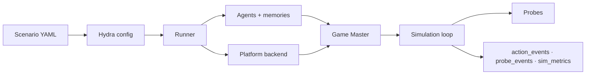

---
hide:
  - navigation
  - toc
---

<canvas class="sx-hero__net" id="sx-net" aria-hidden="true"></canvas>

Silicon Society Sandbox

# Spin up societies of agents

Configurable multi-agent social simulations populated by LLM-powered generative
agents, each with a persona, memory, and goals. You define four axes in YAML: the
environment agents inhabit, the agents themselves, the simulation engine that
schedules how and when they act, and the evaluation that measures them. SiliSocS
runs the world.

[Install](installation.md){ .md-button .md-button--primary }
[Quick start](quickstart.md){ .md-button }
[Browse the guide](usage.md){ .md-button }
[GitHub](https://github.com/sandbox-social/silisocs){ .md-button }

**SiliSocS turns a research question into a running simulation.** You describe a
world in YAML: who the agents are, which environment they inhabit, the simulation
engine that schedules how they act, and what you want to measure. SiliSocS
populates it with LLM-driven agents, runs the interaction loop, and logs
structured results you can analyze or reproduce. Social media is one example
domain: built-in environments also include a resource market and a virtual space,
and you can plug in your own.

**Research**

- ICML 2026 position paper: [paper (PDF)](https://www.complexdatalab.com/stamina/papers/puelmatouzel_CloseEvalGap.pdf)
- EASE configuration: [arXiv:2605.30258](https://arxiv.org/abs/2605.30258)

Earlier work centered on a served Mastodon network:

- NeurIPS 2024 workshop: [arXiv:2410.13915](http://arxiv.org/abs/2410.13915)
- IJCAI 2025 demo: [IJCAI 2025 proceedings](https://www.ijcai.org/proceedings/2025/1271)

## Choose your path

-   🌍 __Run worlds__

    ---

    Design and run simulations entirely in YAML, no Python required. Start from
    the default scenario and build out from there.

    [Quick Start →](quickstart.md)

-   🛠️ __Extend the framework__

    ---

    Add custom agents, backends, probes, game-master components, and policies
    through clean class-path extension points.

    [Building Agents →](building_agents.md)

-   🔬 __Run a study__

    ---

    Design reproducible multi-condition studies with seed grids, SLURM,
    provenance locks, and built-in statistics.

    [Study Guide →](study_guide.md)

## How it works

A scenario's YAML is composed by Hydra into a single runtime config. The runner
builds the agent population and their memories, stands up a platform backend, and
hands control to a **game master**, which decides who acts next, shows each agent
its slice of the world, and resolves their responses into concrete actions. The
simulation engine advances episodes, deploys evaluation probes, and writes every
action and measurement to disk for analysis.

## Highlights

-   🧩 __Declarative scenarios__

    ---

    Agents, settings, networks, and probes in YAML, with full Hydra composition,
    CLI overrides, and per-agent LLMs.

    [Scenario Guide →](scenario_guide.md)

-   🌐 __Multiple backends__

    ---

    Local Twitter-like and Reddit-like apps, a real Mastodon server, a resource
    market, or a virtual space.

    [Backends →](backends.md)

-   🧪 __Evaluation probes__

    ---

    Deploy longitudinal surveys (numeric, binary, choice, and free-text) to agents
    during a run.

    [Probes →](probes.md)

-   🔬 __Reproducible studies__

    ---

    Seed grids, SLURM dispatch, provenance locks, and built-in cross-seed
    statistics out of the box.

    [Study Guide →](study_guide.md)

## Start here

[Installation](installation.md){ .md-button .md-button--primary }
[Quickstart](quickstart.md){ .md-button }
[Configuration reference](configuration.md){ .md-button }
[Studio](studio.md){ .md-button }

Looking for something specific? Use the tabs above to open a section (its pages
appear in the sidebar there), the search box, or the
[Glossary](glossary.md) if a term is unfamiliar.
