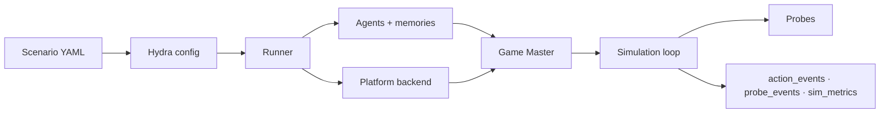

---
hide:
  - navigation
  - toc
---

<canvas class="sx-hero__net" id="sx-net" aria-hidden="true"></canvas>

Social Simulation Sandbox

# Spin up societies of agents

Large-scale social-media simulations populated by LLM-powered generative agents —
each with a persona, memories, and goals — interacting through configurable
platform backends. Define everything in YAML; the engine runs the world.

[Get started](quickstart.md){ .md-button .md-button--primary }
[Browse the guide](usage.md){ .md-button }
[GitHub](https://github.com/sandbox-social/silisocs){ .md-button }

**silisocs turns a research question into a running society.** You describe a
world in YAML — who the agents are, which platform they inhabit, and what you
want to measure — and the engine populates it with LLM-driven agents, runs the
interaction loop, and logs structured results you can analyze or reproduce.

<small>
Research: [NeurIPS 2024 Workshop](http://arxiv.org/abs/2410.13915) ·
[IJCAI 2025 Demo](https://www.ijcai.org/proceedings/2025/1271) ·
Version 2 adds structured scenario configuration with an optional Concordia bridge.
</small>

## Choose your path

-   🌍 __Run worlds__

    ---

    Design and run simulations entirely in YAML — no Python required. Start from
    the default scenario and build out from there.

    [Quick Start →](quickstart.md)

-   🛠️ __Extend the framework__

    ---

    Add custom agents, backends, probes, game-master components, and policies
    through clean class-path extension points.

    [Building Agents →](building_agents.md)

-   🔬 __Run a study__

    ---

    Design reproducible multi-condition studies with seed grids, SLURM,
    provenance locks, and built-in statistics.

    [Study Guide →](study_guide.md)

## How it works

A scenario's YAML is composed by Hydra into a single runtime config. The runner
builds the agent population and their memories, stands up a platform backend, and
hands control to a **game master** — which decides who acts next, shows each agent
its slice of the world, and resolves their responses into concrete actions. A
simulation loop advances episodes, deploys evaluation probes, and writes every
action and measurement to disk for analysis.

## Highlights

-   🧩 __Declarative scenarios__

    ---

    Agents, settings, networks, and probes in YAML — full Hydra composition with
    CLI overrides and per-agent LLMs.

    [Scenario Guide →](scenario_guide.md)

-   🌐 __Multiple backends__

    ---

    Local Twitter-like and Reddit-like apps, a real Mastodon server, a resource
    market, or a virtual space.

    [Backends →](backends.md)

-   🧪 __Evaluation probes__

    ---

    Deploy longitudinal surveys — numeric, binary, choice, free-text — to agents
    during a run.

    [Probes →](probes.md)

-   🔬 __Reproducible studies__

    ---

    Seed grids, SLURM dispatch, provenance locks, and built-in cross-seed
    statistics out of the box.

    [Study Guide →](study_guide.md)

## Start here

[Quickstart](quickstart.md){ .md-button .md-button--primary }
[Configuration reference](configuration.md){ .md-button }
[Dashboard](dashboard.md){ .md-button }

Looking for something specific? Everything is in the left sidebar and the tabs above.
