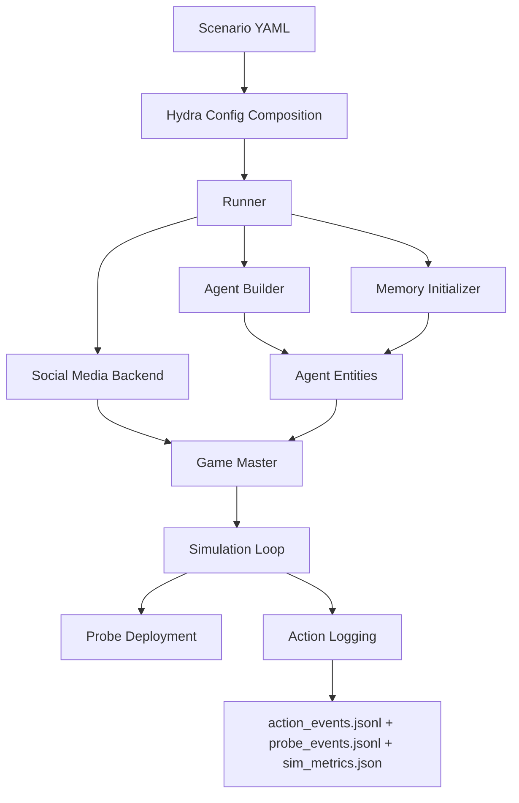

# Social Simulation Sandbox

**Configurable generative agent simulation of social media using the [Concordia framework](https://github.com/google-deepmind/concordia).**

- 2024 NeurIPS Workshop Paper: [arXiv:2410.13915](http://arxiv.org/abs/2410.13915)
- 2025 IJCAI Demo Paper: [IJCAI 2025](https://www.ijcai.org/proceedings/2025/1271)
- Version 2: Structured scenario configuration compatible with Concordia v2

---

## What is this?

Social Simulation Sandbox lets you spin up large-scale social media simulations
populated by LLM-powered generative agents. Each agent has a unique persona,
memories, and goals — and they interact on a simulated social media platform
(Twitter-like, Reddit-like, or a real Mastodon instance).

You configure everything in YAML: the scenario setting, agent populations,
social network topology, evaluation probes, and platform type. The framework
handles the rest — memory initialization, agent action loops, probe deployment,
and structured output logging.

## Key Features

| Feature | Description |
|---------|-------------|
| **Declarative scenarios** | Define agents, settings, and networks in YAML — no Python needed for most use cases |
| **Multiple platforms** | Local Twitter-like and Reddit-like backends (SQLite), or a real Mastodon server |
| **Scalable** | Tested with 5000+ concurrent agents using adaptive concurrency control |
| **Persona pipeline** | Source agent personas from HuggingFace datasets, local JSON, inline YAML, or config references |
| **Memory initialization** | Raw (config-only) or formative (LLM-generated backstories) modes, with custom initializers |
| **Evaluation probes** | Deploy longitudinal surveys (numeric, binary, choice, free-text) to agents during simulation |
| **Per-agent LLM** | Assign different LLM models per agent class or per individual agent |
| **Streamlit dashboard** | GUI for creating scenarios, configuring agents, and launching simulations |
| **Hydra config** | Full Hydra composition with CLI overrides, sweep support, and structured logging |
| **Rich output** | Action events, probe responses, LLM logs, timing telemetry, and structured metrics (JSON) |
| **Built-in visualizers** | Web UIs for browsing simulated Twitter/Reddit platforms (user profiles, threads, admin stats) |

## For End Users

If your goal is to **design and run scenarios** without writing code:

1. Start with the [Quick Start](quickstart.md) to run the default scenario
2. Read the [Usage Overview](usage.md) for the full workflow
3. Use the [Dashboard](dashboard.md) to create scenarios visually
4. See the [Election Walkthrough](tutorials/election.md) for a real-world example
5. Check [Configuration Reference](configuration.md) for all knobs

## For Developers

If you want to **extend the framework** (new backends, entities, probes, initializers):

1. Read the [Usage Overview](usage.md) to understand the pipeline
2. See [Building Agents](building_agents.md) for custom builder classes
3. See [Memory Initialization](memory_initialization.md) for custom initializers
4. See [Social Media Backends](backends.md#adding-a-new-backend-developer-guide) for new platform backends
5. See [Evaluation Probes](probes.md#custom-probe-types) for custom probe types
6. Check [Contributing](contributing.md) for code standards and workflows

## Quick Links

- [Installation](installation.md) — Set up the project
- [Quick Start](quickstart.md) — Run your first simulation in 5 minutes
- [Usage Overview](usage.md) — End-to-end guide to the system
- [Configuration Reference](configuration.md) — All config options explained
- [Building Agents](building_agents.md) — YAML pipeline and custom builders
- [Election Walkthrough](tutorials/election.md) — Step-by-step complex scenario tutorial

## Architecture at a Glance



## Project Structure

```
mastodon-sim/
├── src/mastodon_sim/
│   ├── agents/              # Agent entities, builders, memory initialization
│   ├── conf/                # Hydra YAML config hierarchy
│   ├── dashboard/           # Streamlit GUI
│   ├── environments/        # Social media backends + game master
│   ├── evaluations/         # Evaluation probes
│   ├── runtime/             # Runner, config, simulation orchestration
│   └── utils/               # Network generation utilities
├── scenarios/               # External scenario directories
├── docs/                    # This documentation
└── tests/                   # Test suite
```
