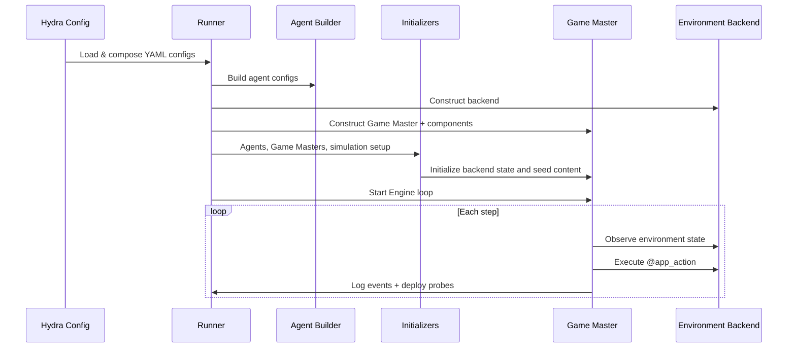

# Usage Overview

This guide covers the complete workflow for running SiliSocS simulations:
from configuration to output analysis.

The terms it leans on — **run**, **step**, **scenario**, **flow**, **game
master** — are each defined once in the [Glossary](glossary.md).

## How It Works

The simulation runs in four phases:



**Phase 1, Config composition**: Hydra merges the base simulation config,
environment config, and world config into a single resolved config tree.

**Phase 2, Agent construction**: The agent builder reads the persona pipeline
(or custom builder logic) and creates agent configs with personas, memories,
and goals. Runtime construction then creates live agents.

**Phase 3, Runtime initialization**: The Engine runs agent initialization,
Game Master initialization, then simulation initialization before the main loop.

**Phase 4, Simulation loop**: Each step, agents observe environment state,
decide on an action, and the game master executes it against the configured
backend. Each backend provides its own observations through the GM component
slots; `app_observation` delegates directly to `BackendApp.observe(...)`.
Probes are deployed on schedule.

---

## Running a Simulation

For multi-condition research orchestration (hypothesis trees, seed sweeps, and
built-in evaluators), start with the [Study Guide](study_guide.md).

### CLI (Recommended)

The primary entry point is the `silisocs` CLI command:

```sh
# Check your environment first (Python, optional extras, API keys, writability)
uv run silisocs doctor

# First time? Run a guided deterministic demo (no API key needed) — it runs a
# small scripted simulation, tours the artifacts it produced, and prints the
# next commands to try
uv run silisocs tutorial

# Run with defaults
uv run silisocs

# Override parameters via Hydra
uv run silisocs num_agents=10 num_steps=5 sim.llm.name=gpt-4o

# Use a different backend
uv run silisocs env=reddit_like

# Run the packaged resource-market preset
uv run silisocs world=resource_market agents=resource_market env=resource_market

# Run the packaged virtual-space preset
uv run silisocs world=virtual_space agents=virtual_space env=virtual_space

# Run curated external backend examples
uv run silisocs --config-path scenarios/resource_market/conf world=resource_market agents=resource_market env=resource_market
uv run silisocs --config-path scenarios/virtual_space/conf world=virtual_space agents=virtual_space env=virtual_space

# Run an external scenario
uv run silisocs --config-path scenarios/election/conf
```

### Hydra CLI Overrides

Any config value can be overridden from the command line using dot notation:

```sh
uv run silisocs \
  num_agents=100 \
  num_steps=50 \
  seed=42 \
  env.gm.components.initialize.params.graph.network_type=random

# Switch GM resolve mode to tool-calling
uv run silisocs \
  env.gm.components.resolve.built_in=tool_calling \
  sim.tool_calling.mode=single

# Override only who can act next
uv run silisocs env.gm.components.next_acting.built_in=all_agents
```

### Studio

For a visual interface:

```sh
uv run silisocs-studio --output-root outputs --port 8765
```

Install the `silisocs[studio]` extra when using a lean package install. Studio
provides scenario and study composers, launch/watch controls, platform viewers,
artifact analysis, and report export in one product.

See [Studio](studio.md) for details.

---

## Configuration System

The project uses [Hydra](https://hydra.cc/) for hierarchical YAML configuration
with composition. The top-level package config is
`src/silisocs/conf/experiment.yaml` and composes these groups:

```yaml
# experiment.yaml
defaults:
  - world: default         # Root run params, setting, event, and world data
  - agents: default        # Agent construction and personas
  - sim: base              # Simulation parameters
  - env: twitter_like      # Backend and GM wiring
  - eval: base            # Probes and evaluation config
```

### Config Hierarchy

```
src/silisocs/conf/
├── experiment.yaml          # Top-level composition
├── agents/
│   └── default.yaml         # Persona pipeline defaults
├── world/
│   └── default.yaml         # Root run params and default world
├── sim/
│   └── base.yaml            # LLM, engine, tool-calling, memory, checkpoints
├── env/
│   ├── twitter_like.yaml    # Local Twitter-like backend
│   ├── reddit_like.yaml     # Local Reddit-like backend
│   └── mastodon.yaml        # Remote Mastodon server
└── eval/
    └── base.yaml            # Probe and logging defaults
```

See [Configuration Reference](configuration.md) for all options. Every
pluggable piece — engines, policies, GM components, backends, checkpoint
strategies — shares one `{built_in | class_path, params}` shape, described once
under [Slots](configuration.md#slots).

For environment-level customization (Engine + GM components + backends), see
[Environment Layer](environment_layer.md).

### External Scenarios

Scenarios can live outside the package in `scenarios/<name>/conf/`:

```
scenarios/election/
├── conf/
│   ├── world/default.yaml    # @package _global_
│   ├── agents/default.yaml   # @package agents
│   ├── sim.yaml              # Optional partial sim override
│   ├── env.yaml              # Optional partial env override
│   └── eval.yaml             # Optional partial eval override
├── input/                    # Optional scenario assets (personas, news data)
├── builders.py               # Optional importable custom agent builder
└── README.md                 # Brief description for discoverability
```

Run with:

```sh
uv run silisocs --config-path scenarios/election/conf
```

The runner reads `scenario_name` from the world config automatically, so you
usually do not need a manual `world=` override. Run output does **not** land
inside the scenario directory; it goes to the Hydra-managed path under
`outputs/` described in [Output](#output).

Authoring one of these from scratch is covered step by step in the
[Scenario Guide](scenario_guide.md); the election scenario is read back key by
key in the [Election Walkthrough](tutorials/election.md).

---

## Agent Pipeline

Agents are defined in the `persona_pipeline` section of your scenario config.
There are two methods:

### Method 1: YAML Pipeline (Declarative)

Define agent classes with data sources and field mappings:

```yaml
builder:
  class_path: null
  params: {}

persona_pipeline:
  classes:
    user:
      count: 100
      class_path: silisocs.agents.native.NativeAgent
      data:
        source: inline
        records:
          - name: Alex
            persona: Alex is a local organizer who posts about public services.
      field_map:
        name: name
        context: persona
```

Hugging Face datasets are available with the `hf` extra:

```sh
pip install "silisocs[hf]"
```

```yaml
data:
  source: hf_dataset
  dataset: nvidia/Nemotron-Personas-USA
  split: train
```

### Method 2: Custom Builder (Programmatic)

Set `agents.builder.class_path` when you need programmatic agent-spec logic:

```python
from silisocs.runtime.construction.agent_builders import AgentBuilder
from silisocs.runtime.construction.specs import AgentConfig

class MyScenarioAgentBuilder(AgentBuilder):
    def build_agent_configs(self):
        return [AgentConfig(...) for _ in range(3)]
```

See [Building Agents](building_agents.md) for the full guide.

---

## Per-Agent LLM Models

You can assign different LLM models at three levels:

**Global default**, in `sim/base.yaml`:
```yaml
llm:
  provider: openai
  name: gpt-4o
```

**Per-class**, in the persona pipeline:
```yaml
classes:
  voter:
    count: 100
    model: gpt-4o-mini      # Cheaper model for voters
  candidate:
    count: 2
    model: gpt-4o            # Better model for key agents
```

`model` may also be a full LLM block that overrides `sim.llm` per-field (unset
fields fall back to global); `extra_kwargs` replaces rather than merges:
```yaml
classes:
  candidate:
    count: 2
    model:
      name: gpt-4o
      temperature: 0.2
      provider: openai
      # api_base, api_key, extra_kwargs, disabled also accepted
```

**Per-agent**, via field mapping:
```yaml
classes:
  user:
    count: 50
    data:
      source: local_json
      path: agents.json       # Must have a "model" field per record
    field_map:
      name: name
      context: persona
      model: model_name       # Maps to per-agent model assignment
```

Priority: per-agent field_map > per-class config > global default. This priority
applies to the model `name`; for a per-class block, each other field overrides
the matching global `sim.llm` field and falls back to global when unset.

---

## Social Graph And Activity

Graph fields feed the GM initialize component. Activity rates feed the GM
`next_acting` slot.

```yaml
gm:
  components:
    initialize:
      params:
        graph:
          network_type: barabasi_albert
          barabasi_albert_m: 10
          base_followership_probability: 0.3
          fully_connected_targets:
            - news_account
```

Activity selection is sim-level participation config (`conf/sim.yaml`):

```yaml
engine:
  participation:
    built_in: activity_probability
    params:
      activity_transition_rates:
        user:
          inactive_to_active: 0.3
          active_to_inactive: 0.3
```

Only active agents take actions. Two built-in activity models read these rates:

- `activity_probability` (shown above) draws each agent independently every
  step — `inactive_to_active` is the per-step probability of being active, so
  the example keeps each agent active ~30% of steps.
- `activity_markov` runs a two-state Markov chain per agent: each step an
  active agent goes inactive with `active_to_inactive`, an inactive one
  activates with `inactive_to_active` (long-run active share
  `on / (on + off)` — 50% in the example).

A rates entry may declare either key; the missing one mirrors the declared one.

---

## Fixed-Action Agents

Use `silisocs.agents.fixed.FixedAgent` when you want deterministic,
episode-aware behavior without LLM action generation.

Minimal pattern:

```yaml
persona_pipeline:
  classes:
    broadcaster:
      count: 1
      class_path: silisocs.agents.fixed.FixedAgent
      sim_role_name: broadcaster
      data:
        source: inline
        records:
          - context: Official broadcaster account
            name: Town Bulletin
      field_map:
        name: name
        context: context
      params:
        flow_tag: fixed_pre
        fixed_action_plan:
          0:
            - action_type: POST
              target_id: ""
              content: "Daily bulletin from {name}: please stay informed."
              reasoning: "Scheduled bulletin at simulation start."
          5:
            - action_type: POST
              target_id: ""
              content: "Emergency update from {name}: check local advisories."
              reasoning: "Scheduled follow-up bulletin."

sim:
  engine:
    step:
      built_in: flow
      params:
        flow_order: [fixed_pre, default]
  gm:
    components:
      observe:
        built_in: timeline_every_turn
        params:
          episode_observation_flows: [fixed_pre]
```

Behavior notes:

- Fixed agents parse episode index from observation text (for example `EPISODE: 12`).
- If no episode number is parseable, the fixed agent increments its internal counter by 1.
- The action text emitted by fixed agents is compatible with existing resolve components.
- `fixed_action_plan` is strict dict-only (`episode -> list[action]`), not list-based.
- You can load the same structure from a file using `params.fixed_action_plan_file` (`.json/.yaml/.yml`).

Compatibility notes:

- Fixed-action items use backend action names (or selectable aliases).
- `env.gm.backend.enabled_actions` and `env.gm.backend.excluded_actions` apply
  globally and can restrict fixed-action items.

---

## Memory Initialization

Before the simulation loop starts, the Engine runs agent initialization and
populates each agent's memory:

1. **Shared memories** (from config) are broadcast to all agents
2. **Generated memories** (from `generate_memories()`) are per-agent
3. **Specific memories** (per-agent, from config) are injected last

Two built-in modes:

| Mode | Config | Behavior |
|------|--------|----------|
| **Raw** | `sim.initialization.agents.built_in: raw_memory` | No LLM calls, only config memories |
| **Formative** | `sim.initialization.agents.built_in: formative_memory` | LLM-generated multi-episode backstories |

See [Memory Initialization](memory_initialization.md) for custom initializers.

---

## Evaluation Probes

Probes are periodic surveys deployed to agents during the simulation:

```yaml
probes:
  deployment:
    enabled: true
    start_step: 1
    every_n_steps: 5
  probes:
    satisfaction:
      probe_name: satisfaction
      probe_type: NumericRatingProbe
      probe_data:
        name: Satisfaction
        question: "On a scale of {lo} to {hi}, how satisfied are you?"
        lo: 1
        hi: 10
```

Built-in probe types: `NumericRatingProbe`, `BinaryProbe`, `ChoiceProbe`,
`FreeTextProbe`.

See [Evaluation Probes](probes.md) for details.

---

## Run from Python

Everything the CLI does is available in-process — compose a config, run it,
and load the artifacts back, with no subprocess and no Hydra invocation:

```python
from silisocs import compose_config, run_simulation, load_run

cfg = compose_config(
    scenario="misinformation",  # optional; like --config-path
    overrides=["num_steps=2", "sim.llm.provider=scripted"],
)
run_dir = run_simulation(cfg, output_dir="outputs/notebook_run")
artifact = load_run(run_dir)
print(artifact.status, sum(1 for _ in artifact.iter_actions()))
```

Outside a Hydra invocation, pass the `output_dir=` argument explicitly (or set
the config key of the same name, `output_dir`, in your `world` group).
`load_run`/`load_study` return the same typed artifacts Studio and the analysis
panels consume.

---

## Output

Each simulation run produces output under the Hydra-managed directory:

```
outputs/<scenario_name>/<jobname_format>/<scenario_name>_<timestamp>/
```

For the default scenario that is
`outputs/default/N10_T5_independent_run1/default_2026-05-01_12-30-00/`. The
middle level is the `jobname_format` template from the world config
(`N${num_agents}_T${num_steps}_${experiment_name}_${run_name}`); the leaf is
Hydra's job name, which carries the timestamp, so **re-running the same
parameters creates a new directory rather than overwriting the previous run**.
Hydra's own composed-config snapshot is written next to the run directory, not
inside it — `<jobname_format>/configs/<jobname_format>/` (there is no `.hydra/`
directory; `hydra.output_subdir` is redirected).

Setting a non-empty `output_dir` replaces this whole layout with the literal
path you give — see
[Output Configuration](configuration.md#output-configuration).

### Output Files

| File | Format | Description |
|------|--------|-------------|
| `run_manifest.json` | JSON | Self-describing run index: status, run params, GM/backend layout, health counters, LLM usage, artifact paths (including per-GM event logs), and provenance (git commit, package version, `uv.lock` hash). Load a run through this instead of guessing the file layout |
| `run_events.jsonl` | JSONL | The runner's live feed: versioned rows for status transitions and step boundaries (`step_started`/`step_finished`), appended as the run progresses. Tail this to observe a run — Studio's watch view does |
| `action_events.jsonl` | JSONL | Every backend action that COMMITTED a state change (or performed a deliberate logged read), with episode index, Game Master name, backend type, source user, and action data. Rejected, failed, and idempotent calls are not recorded |
| `exposure_events.jsonl` | JSONL | What each agent SAW per turn: post ids + per-post source (`follower`/`recsys:<type>`). On by default; disable via `env.gm.components.observe.params.log_exposures: false` |
| `probe_events.jsonl` | JSONL | Probe/survey responses per agent per deployment step |
| `prompts_and_responses.jsonl` | JSONL | Every LLM call: prompt, response, episode index, and agent name |
| `run_stats.log` | Text | Per-episode timing, worker counts, retry telemetry, and startup phase durations |
| `sim_metrics.json` | JSON | Structured metrics summary: system info, per-episode durations, worker limits, resource snapshots (CPU/memory), and aggregate statistics |
| `<platform>.db` | SQLite | Full social media state (users, posts, replies, likes, follows). Use with the [built-in visualizers](backends.md#built-in-visualizers) to browse |
| `effective_config.yaml` | YAML | The runtime-resolved config, with every `api_key` masked |

One level up, beside the run directory, Hydra writes its own snapshot into
`configs/<jobname_format>/`: `config.yaml` (composed config), `hydra.yaml`,
`overrides.yaml` (the CLI overrides for this run), and a copy of
`effective_config.yaml`.

`effective_config.yaml` (both copies) is written with every
`api_key` masked as `**redacted**`, so a run directory stays shareable even when a
key was set in config rather than the environment.

### Run Health

A run records what it *survived*. Each counter below is incremented during the
run, printed as a `⚠ DEGRADED RUN` line at the end, written to
`run_manifest.json` under `health`, and rendered by Studio's **Run health** panel
(and `RunArtifact.health`). Anything a run cannot legitimately continue past
raises and fails the run instead of being counted.

| Counter | Meaning |
|---------|---------|
| `agent_turn_failures` | Agent turns that raised an exception (isolated: the step continued) |
| `action_parse_failures` | Agent actions dropped as unparseable |
| `action_argument_coercion_failures` | Action arguments that did not match their declared parameter type and were passed through as raw strings (the action still ran) |
| `action_invalid_targets` | Agent actions that referenced invalid target ids |
| `backend_action_errors` | Backend actions that raised unexpectedly |
| `exposure_log_failures` | Exposure rows that could not be written to `exposure_events.jsonl` |
| `harness_tool_failures` | Harness tool calls that failed inside a harness turn |
| `recsys_update_failures` | Scheduled recommendation refreshes that failed (the run continued on the previous rows) |
| `routing_fallbacks` | Branch routing calls that fell back to a default choice |
| `silent_backends` | Backends that committed no action events (names in the manifest) |

Zero on every counter is the only clean run; a non-zero count means results are
partial in a specific, named way. The counter set lives in one registry
(`silisocs.evaluations.vocabulary.HEALTH_COUNTERS`), so a new counter reaches the
warning, the manifest, and the artifact loader together.

Note the split for recommendations: a recsys type you configured that cannot be
*initialized* (unsupported name, missing embedding dependency) is a config error
and **fails the run** — the alternative was running the whole scenario with no
recommender at all. Only a failed per-step *refresh* is survivable, and that is
what `recsys_update_failures` counts.

### Action Events Format

Each line in `action_events.jsonl` is a JSON object:

```json
{
  "episode": 3,
  "event_type": "action",
  "event_index": 42,
  "gm_name": "social_gm",
  "backend_type": "twitter_like",
  "source_user": "Alice Smith",
  "label": "post",
  "data": {
    "content": "Beautiful morning in the neighborhood!",
    "post_id": 127
  }
}
```

### Probe Events Format

Each line in `probe_events.jsonl`:

```json
{
  "episode": 5,
  "event_type": "probe",
  "event_index": 0,
  "data": {
    "agent": "Alice Smith",
    "probe_type": "NumericRatingProbe",
    "question": "Rate your satisfaction 1-10",
    "raw_response": "I'd say about a 7",
    "probe_return": "7"
  }
}
```

### Simulation Metrics

`sim_metrics.json` provides structured data for analysis:

```json
{
  "metadata": {
    "num_agents": 10,
    "num_steps": 5,
    "world": "election",
    "llm": {"name": "gpt-4o"},
    "agent_names": ["Alice Smith", "Bob Jones", "..."]
  },
  "total_duration_s": 1234.5,
  "episodes": [
    {
      "episode": 1,
      "duration_s": 6.2,
      "active_agents": 145,
      "worker_limit": 200,
      "retry_count": 3
    }
  ],
  "resources": {
    "start": {"cpu_percent": 12.5, "memory_mb": 1024},
    "end": {"cpu_percent": 45.2, "memory_mb": 3072}
  }
}
```

### Visualizing Output

Open a run's backend state in the unified Studio workspace:

```sh
uv sync --extra studio
uv run silisocs-studio
```

Select **Runs**, open a run, then select **Platform**. Studio discovers viewer
capabilities declared by each backend and starts the matching read-only view;
custom backends can participate without Studio-specific code.

See [Environment Backends](backends.md#built-in-visualizers) for full details.

### Loading Runs Programmatically

Tools and notebooks should load runs through the Run Artifact Module instead of
re-discovering the file layout:

```python
from silisocs.evaluations.run_artifact import load_run, load_study

run = load_run("outputs/my_world/run_dir")
run.status, run.scenario, run.seed        # from run_manifest.json, which the
run.health, run.llm_usage, run.provenance # loader requires (see Run Health)
for event in run.iter_actions():          # streams flat or per-GM event logs
    ...

study = load_study("experiments/studies/my_study")
study.plan, study.summary, study.provenance
```

Studio loads runs through this same interface, so a run that loads here renders
in the visual analysis views.

---

## End-to-End Workflow

Here is the complete workflow for creating and running a custom world. The
config-authoring steps are compressed here — the [Scenario Guide](scenario_guide.md)
is the canonical step-by-step walkthrough, with worked files and common patterns.

### 1. Create the Scenario Directory

```sh
mkdir -p scenarios/my_world/conf/world scenarios/my_world/conf/agents
```

### 2. Write the Scenario Configs

Two files are required — run parameters plus narrative, and the agent
population. This is the shape; see the
[Scenario Guide](scenario_guide.md) for the annotated version and
[Configuration](configuration.md) for every key.

```yaml
# scenarios/my_world/conf/world/default.yaml
# @package _global_
scenario_name: my_world
jobname_format: "N${num_agents}_T${num_steps}_${experiment_name}_${run_name}"
num_agents: 3
num_steps: 10
seed: 42
run_name: my_world
output_dir: ""

setting:
  name: My Community
  background:
    - A small online community focused on technology discussions.

event:
  name: Product launch
  context: |
    A new product has been announced and community members
    are discussing its merits and drawbacks.
```

```yaml
# scenarios/my_world/conf/agents/default.yaml
# @package agents
persona_pipeline:
  defaults:
    params:
      world_context: ${event.context}
    shared_memories:
      - ${event.context}
  classes:
    user:
      count: ${num_agents}
      class_path: silisocs.agents.native.NativeAgent
      sim_role_name: user
      data:
        source: inline
        records:
          - name: Alex
            persona: Alex follows product launches and asks practical questions.
          - name: Blair
            persona: Blair studies developer tools and compares alternatives.
          - name: Casey
            persona: Casey moderates the forum and keeps discussions on topic.
      field_map:
        name: name
        context: persona

initial_observations:
  - "{name} is browsing the forum."
```

The optional `conf/env.yaml` (social graph, backend, GM components) and
`conf/sim.yaml` (per-role participation rates, LLM, engine) are shown with
worked values under
[Scenario Guide → Common patterns](scenario_guide.md#common-patterns).

### 3. Run It

```sh
uv run silisocs --config-path scenarios/my_world/conf num_agents=20 num_steps=10
```

### 4. Analyze Output

Output appears under `outputs/my_world/<jobname_format>/my_world_<timestamp>/`;
the CLI prints the exact path at startup. See [Output](#output).

### 5. (Optional) Add a Custom Builder

If you need programmatic control over agent construction:

```python
# scenarios/my_world/builders.py
from silisocs.runtime.construction.agent_builders import AgentBuilder

class MyScenarioAgentBuilder(AgentBuilder):
    def build_agent_configs(self):
        # Custom logic here
        ...
```

### 6. (Optional) Use Studio

```sh
uv run silisocs-studio --output-root outputs --port 8765
```

Create the world visually, preflight it, launch, watch artifacts grow, and inspect
the completed run without changing tools.

To replay simulation state from a previous run, use `sim.checkpoint.source_run`
in the launch overrides.

### 7. Replay from a Checkpoint

Enable checkpointing during a run:

```sh
uv run silisocs \
  --config-path scenarios/my_world/conf \
  num_steps=200 \
  sim.checkpoint.every_n_steps=10
```

Then restore from the previous output directory:

```sh
uv run silisocs \
  --config-path scenarios/my_world/conf \
  num_steps=200 \
  sim.checkpoint.source_run=outputs/my_world/run1 \
  sim.checkpoint.restore.built_in=social_action_event_replay
```

Current checkpoints store default agent state, game-master component state, and
the state of built-in local backends. For SQLite-backed backends such as
`twitter_like` and `reddit_like`, the checkpoint stores a database snapshot. The
restore strategy is only used when checkpointed backend state is absent and a
domain-specific replay is needed.

For multi-GM source runs, replay is metadata-driven and strict. The runtime uses
the restored Agent flow and the configured flow chain, then requires exactly one
GM in that chain to expose the replayed backend action.

---

## Developer Customization Guide

This section maps key runtime tasks to concrete extension points for developer
users.

### Engine Responsibilities

The runtime now includes direct engine step strategies:

- `sim.engine.step.built_in: base` (default): simple execution path, one GM active per episode.
- `sim.engine.step.built_in: sequential`: one GM, selected agents executed one by one.
- `sim.engine.step.built_in: flow`: flow-aware execution.
- `sim.engine.step.built_in: multi_gm` / `multi_gm_serial` / `multi_gm_staged`:
  flow-aware execution with multi-GM routing; the three variants select the
  flow-chain traversal mode (see below).

For the `multi_gm*` strategies, all configured Game Masters update once at the
start of each episode step, before flow routing and actor selection. Flow chains
then route selected agent turns through the configured GMs; `gm.update(...)` is
not called again inside each flow chain.

Chain traversal is selected by `sim.engine.step.built_in` (the former
`sim.engine.step.params.chain_execution` knob has been removed; a config that
still sets it raises a `ValueError` with a migration hint):

- `multi_gm` (default, concurrent): flows run as independent pipelines through
  their GM chains. Distinct flows advance concurrently and a flow's next hop
  starts as soon as its own previous hop completes — turns serialize only when
  two flows touch the same GM at the same time (the engine's existing per-GM
  lock). Flows listed in `flow_order` run first as a strict serial prefix,
  preserving declared precedence such as seed-then-act (`fixed_pre` before
  `default`); every other flow runs as the concurrent group. A single agent's own
  chain hops always stay serial, since each hop observes the prior hop's
  resolution. This is the unchanged default behavior.
- `multi_gm_serial`: legacy row-major — each flow runs its full GM chain to
  completion before the next flow, one batch at a time, in a deterministic
  flow-by-flow order.
- `multi_gm_staged`: column-major with a global per-stage barrier — `flow_order`
  flows run first as a serial prefix, then every remaining flow advances one stage
  at a time, with all flows' stage-N hops running concurrently and stage N+1
  blocked until all of stage N finishes. A `null` chain entry (empty slot) idles a
  flow at that stage so differently-shaped chains stay stage-aligned.

Checkpoint replay is per-agent-flow-chain regardless of the traversal mode.

The engine is responsible for:

- Episode loop orchestration (`run_loop`)
- Probe scheduling and deployment timing
- Selecting acting agents and action specs for each episode
- Running agent actions concurrently and resolving them through the GM (under
  the default `multi_gm` strategy, this also covers cross-flow/cross-chain
  concurrency, gated by shared-GM overlap)
- Worker throttling based on retry telemetry

Key implementation: `src/silisocs/simulation_engines/base_engines.py`.

#### Current Action Semantics

Action semantics are policy-driven through `sim.engine.turn_policy`.

- `single_action`: one resolved action per acting agent per episode.
- `fixed_count`: a fixed number of resolved actions per acting agent.
- `open_ended`: continue until stop token or max action budget.

Built-in turn policies also accept `observe_before_act: first | always | never`.
The default `first` preserves existing behavior by observing before the first
action in a repeated-action turn.

Turn scheduling is orthogonal to the policy: `sim.engine.executor` selects
`threads` (default) or `asyncio` (turns run as coroutines on one event loop —
thousands of LLM calls in flight on a few threads). Behavior is identical across
executors; see the configuration reference.

Probe timing is policy-driven through `eval.probes.schedule`.

#### Defining New Agent Behavior Flows

To introduce new class-level behavior phases without engine/resolve bloat:

1. Set `flow_tag` per class in `persona_pipeline.classes`.
2. Define phase order in `sim.engine.step.params.flow_order`.
3. Optionally add per-agent overrides with `sim.engine.step.params.agent_to_flow`.
4. Add any flow names that require episode-style observations to
  `env.gm.components.observe.params.episode_observation_flows`.

`agent_to_flow` keys must match final Agent names. Overrides are applied during
runtime construction and passed to the Engine and every Game Master as the
final flow map.

This pattern is how fixed agents run before default LLM-driven agents today,
and it generalizes to any future specialized class.

### Game Master Responsibilities

The environment GM (`GameMaster` + native components) is responsible for:

- Initializing the active backend app through its initialize component
- Building generic or timeline observations for each acting agent
- Parsing and dispatching actions (`custom`, `generic`) and tool calls (`none`, `single`, `multi`)
- Applying action effects through the backend app contract
- Managing activity-state-based actor gating

Key implementations:

- `src/silisocs/environments/gm/game_master.py`
- `src/silisocs/environments/gm/components/`

### What Developers Commonly Customize

#### Engine-side tasks

- Multi-action-per-episode turn policy (`sim.engine.turn_policy`)
- Alternative actor scheduling policies
- Probe timing policy (`eval.probes.schedule`)
- Concurrency and retry throttling strategy

#### GM-side tasks

- Action grammar and parsing through resolve components
- Action dispatch strategy by resolve mode (`parsed_action`, `generic_action`, `tool_calling`)
- Observation shaping (`app_observation`, `timeline_every_turn`, or custom component)
- Activity transition behavior through next-acting components
- Seed posts through simulation initialization, then normal `resolve_action`

### Backend Contract Tasks

For platform extensions, backend classes implement `BackendApp` and are
selected by `env.gm.backend.type` or `env.gm.backend.class_path` through the backend factory.
Typical developer tasks include adding new `@app_action` methods, observations,
optional timeline semantics, and storage/query behavior.

---

## Further Reading

- [Configuration Reference](configuration.md): Every config option explained
- [Building Agents](building_agents.md): YAML pipeline and custom builders
- [Memory Initialization](memory_initialization.md): Raw, formative, and custom modes
- [Environment Backends](backends.md): Generic apps, Twitter-like, Reddit-like, Mastodon
- [Evaluation Probes](probes.md): Probe types and deployment
- [Study Guide](study_guide.md): Multi-condition studies, seed grids, evaluators
- [Studio](studio.md): unified visual workflow and extension guide
- [Election Walkthrough](tutorials/election.md): Complex real-world example
