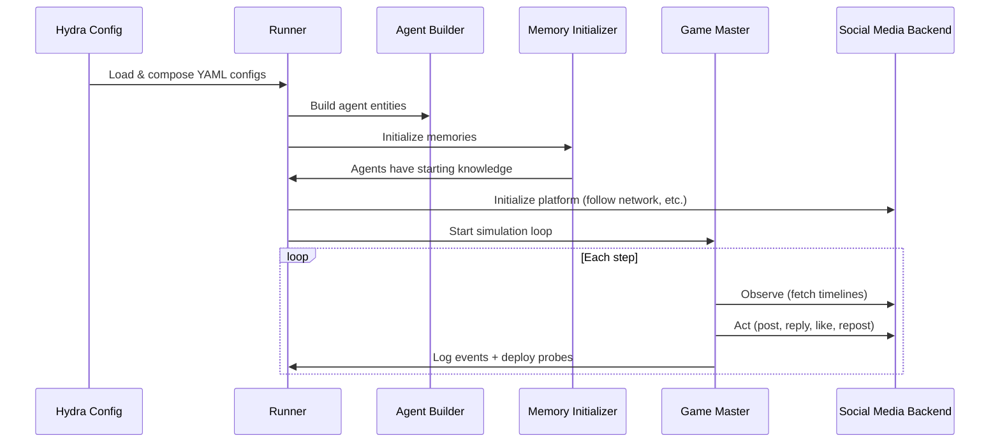

# Usage Overview

This guide covers the complete workflow for running social media simulations —
from configuration to output analysis.

## How It Works

The simulation runs in four phases:



**Phase 1 — Config composition**: Hydra merges the base simulation config,
platform config, and scenario config into a single resolved config tree.

**Phase 2 — Agent construction**: The agent builder reads the persona pipeline
(or custom builder logic) and creates agent entities with personas, memories,
and goals.

**Phase 3 — Memory initialization**: The initializer GM injects shared memories,
generates per-agent memories (raw or formative mode), and hands control to the
main game master.

**Phase 4 — Simulation loop**: Each step, agents observe their timeline, decide
on an action, and the game master executes it against the social media backend.
Probes are deployed on schedule.

---

## Running a Simulation

### CLI (Recommended)

The primary entry point is the `mastodon-sim` CLI command:

```sh
# Run with defaults
uv run mastodon-sim

# Override parameters via Hydra
uv run mastodon-sim sim.num_agents=50 sim.num_steps=20 sim.llm_name=gpt-4o

# Use a different platform
uv run mastodon-sim social_media=reddit_like

# Run an external scenario
uv run mastodon-sim --config-path scenarios/election/conf
```

### Hydra CLI Overrides

Any config value can be overridden from the command line using dot notation:

```sh
uv run mastodon-sim \
  sim.num_agents=100 \
  sim.num_steps=50 \
  sim.seed=42 \
  sim.memory_backend=associative \
  scenario.social_network.network_type=random

# Switch GM resolve mode to tool-calling
uv run mastodon-sim sim.gm.components.resolve.built_in=tool_calling

# Override only who can act next
uv run mastodon-sim sim.gm.components.next_acting.built_in=all_entities
```

### Dashboard

For a visual interface:

```sh
uv run streamlit run src/mastodon_sim/dashboard/launch_app.py
```

The launcher sidebar loads configs in two steps: choose a scenario first, then
choose whether to start from the scenario definition or a prior run snapshot.

See [Dashboard](dashboard.md) for details.

---

## Configuration System

The project uses [Hydra](https://hydra.cc/) for hierarchical YAML configuration
with composition. The top-level config composes three sub-configs:

```yaml
# config.yaml
defaults:
  - sim: base              # Simulation parameters
  - social_media: twitter_like  # Platform backend
  - scenario: default      # Scenario definition
```

### Config Hierarchy

```
src/mastodon_sim/conf/
├── config.yaml              # Top-level composition
├── sim/
│   └── base.yaml            # LLM, agent count, steps, memory, etc.
├── social_media/
│   ├── twitter_like.yaml    # Local Twitter-like backend
│   ├── reddit_like.yaml     # Local Reddit-like backend
│   └── mastodon.yaml        # Remote Mastodon server
└── scenario/
    └── default.yaml         # Default generic scenario
```

See [Configuration Reference](configuration.md) for all options.

For environment-level customization (Engine + GM components + backends), see
[Environment Layer](environment_layer.md).

### External Scenarios

Scenarios can live outside the package in `scenarios/<name>/conf/`:

```
scenarios/election/
├── conf/
│   └── scenario/
│       └── election.yaml    # Scenario config with @package header
├── builders.py              # Optional custom agent builder
└── outputs/                 # Simulation output (auto-created)
```

Run with:

```sh
uv run mastodon-sim --config-path scenarios/election/conf
```

The runner auto-detects the scenario name from the YAML files in the external
directory — no manual `scenario=election` override needed.

---

## Agent Pipeline

Agents are defined in the `persona_pipeline` section of your scenario config.
There are two methods:

### Method 1: YAML Pipeline (Declarative)

Define agent classes with data sources and field mappings:

```yaml
persona_pipeline:
  processing_mode: raw
  classes:
    user:
      count: 100
      prefab_module: mastodon_sim.agents.entity
      data:
        source: hf_dataset
        dataset: nvidia/Nemotron-Personas-USA
        split: train
      field_map:
        context: persona
```

### Method 2: Custom Builder (Programmatic)

Create a `builders.py` in your scenario directory:

```python
from mastodon_sim.agents.builders import BaseAgentBuilder
from mastodon_sim.runtime.dataclasses import AgentConfig

class MyScenarioAgentBuilder(BaseAgentBuilder):
    def build_role_agents(self, role, count):
        return [AgentConfig(...) for i in range(count)]
```

See [Building Agents](building_agents.md) for the full guide.

---

## Per-Agent LLM Models

You can assign different LLM models at three levels:

**Global default** — in `sim/base.yaml`:
```yaml
llm_name: gpt-4o
```

**Per-class** — in the persona pipeline:
```yaml
classes:
  voter:
    count: 100
    model: qwen3.5-4b       # Cheaper model for voters
  candidate:
    count: 2
    model: gpt-4o            # Better model for key agents
```

**Per-agent** — via field mapping:
```yaml
classes:
  user:
    count: 50
    data:
      source: local_json
      path: agents.json       # Must have a "model" field per record
    field_map:
      context: persona
      model: model_name       # Maps to per-agent model assignment
```

Priority: per-agent field_map > per-class config > global default.

---

## Social Network

The `social_network` section configures the follower graph:

```yaml
social_network:
  network_type: barabasi_albert     # barabasi_albert | random | lfr_benchmark | predefined
  barabasi_albert_m: 10             # Edges per new node
  base_followership_probability: 0.3
  fully_connected_targets:          # These roles are followed by everyone
    - news_account
  activity_transition_rates:        # Per-role activity model
    user:
      inactive_to_active: 0.3
      active_to_inactive: 0.3
```

The activity model uses a two-state Markov process: each step, an agent
transitions between active and inactive states. Only active agents take actions.

---

## Fixed-Action Entities

Use a dedicated fixed entity prefab when you want deterministic,
episode-aware behavior without LLM action generation.

Minimal pattern:

```yaml
persona_pipeline:
  classes:
    broadcaster:
      count: 1
      prefab_module: mastodon_sim.agents.fixed_entity
      sim_role_name: broadcaster
      data:
        source: inline
        records:
          - context: Official broadcaster account
            name: Town Bulletin
      field_map:
        name: name
        context: context
      params:
        action_flow: fixed_pre
        fixed_action_plan:
          - episode: 0
            action_type: POST
            target_id: ""
            content: "Daily bulletin from {name}: please stay informed."
            reasoning: "Scheduled bulletin at simulation start."
          - episode: 5
            action_type: POST
            target_id: ""
            content: "Emergency update from {name}: check local advisories."
            reasoning: "Scheduled follow-up bulletin."

sim:
  engine:
    flow_routing:
      flow_order: [fixed_pre, default]
  gm:
    components:
      observe:
        built_in: timeline_every_turn
        params:
          episode_observation_flows: [fixed_pre]
```

Behavior notes:

- Fixed entities parse episode index from observation text (for example `EPISODE: 12`).
- If no episode number is parseable, the fixed entity increments its internal counter by 1.
- The action text emitted by fixed entities is compatible with existing resolve components.

Compatibility notes:

- Fixed-action items use backend action names (or selectable aliases).
- `sim.enabled_actions` applies globally and can restrict fixed-action items.

---

## Memory Initialization

Before the simulation loop starts, the initializer game master populates each
agent's memory:

1. **Shared memories** (from config) are broadcast to all agents
2. **Generated memories** (from `generate_memories()`) are per-agent
3. **Specific memories** (per-agent, from config) are injected last

Two built-in modes:

| Mode | Config | Behavior |
|------|--------|----------|
| **Raw** | `processing_mode: raw` | No LLM calls, only config memories |
| **Formative** | `processing_mode: formative` (or `llm_formative`) | LLM-generated multi-episode backstories |

See [Memory Initialization](memory_initialization.md) for custom initializers.

---

## Evaluation Probes

Probes are periodic surveys deployed to agents during the simulation:

```yaml
probes:
  deployment:
    enabled: true
    start_step: 1
    every_n_steps: 5
  queries:
    0:
      query_type: NumericRatingProbe
      query_data:
        interaction_premise_template:
          question: "On a scale of 1-10, how satisfied are you?"
```

Built-in probe types: `NumericRatingProbe`, `BinaryProbe`, `ChoiceProbe`,
`FreeTextProbe`, `TemplateProbe`.

See [Evaluation Probes](probes.md) for details.

---

## Output

Each simulation run produces output under the Hydra-managed directory:

```
scenarios/<scenario_name>/outputs/<jobname>/<jobname>_<timestamp>/
```

### Output Files

| File | Format | Description |
|------|--------|-------------|
| `action_events.jsonl` | JSONL | Every social media action (post, reply, like, repost, follow, etc.) with episode index, source user, and action data |
| `probe_events.jsonl` | JSONL | Probe/survey responses per agent per deployment step |
| `prompts_and_responses.jsonl` | JSONL | Every LLM call — prompt, response, episode index, and agent name |
| `run_stats.log` | Text | Per-episode timing, worker counts, retry telemetry, and startup phase durations |
| `sim_metrics.json` | JSON | Structured metrics summary: system info, per-episode durations, worker limits, resource snapshots (CPU/memory), and aggregate statistics |
| `logs.html` | HTML | Browseable Concordia log with tabs for the Game Master log, per-agent memory logs, and GM memories |
| `<platform>.db` | SQLite | Full social media state (users, posts, replies, likes, follows). Use with the [built-in visualizers](backends.md#built-in-visualizers) to browse |
| `.hydra/config.yaml` | YAML | Fully resolved Hydra config snapshot |
| `.hydra/overrides.yaml` | YAML | CLI overrides used for this run |

### Action Events Format

Each line in `action_events.jsonl` is a JSON object:

```json
{
  "episode": 3,
  "event_type": "action",
  "event_index": 42,
  "source_user": "Alice Smith",
  "label": "post",
  "data": {
    "content": "Beautiful morning in the neighborhood!",
    "post_id": 127
  }
}
```

### Probe Events Format

Each line in `probe_events.jsonl`:

```json
{
  "episode": 5,
  "event_type": "probe",
  "event_index": 0,
  "data": {
    "agent": "Alice Smith",
    "query_type": "NumericRatingProbe",
    "question": "Rate your satisfaction 1-10",
    "raw_response": "I'd say about a 7",
    "query_return": "7"
  }
}
```

### Simulation Metrics

`sim_metrics.json` provides structured data for analysis:

```json
{
  "metadata": {
    "num_agents": 500,
    "num_steps": 200,
    "scenario": "election",
    "llm_name": "gpt-4o",
    "agent_names": ["Alice Smith", "Bob Jones", "..."]
  },
  "total_duration_s": 1234.5,
  "episodes": [
    {
      "episode": 1,
      "duration_s": 6.2,
      "active_agents": 145,
      "worker_limit": 200,
      "retry_count": 3
    }
  ],
  "resources": {
    "start": {"cpu_percent": 12.5, "memory_mb": 1024},
    "end": {"cpu_percent": 45.2, "memory_mb": 3072}
  }
}
```

### Visualizing Output

Point the built-in visualizer at the SQLite database to browse the simulation
state interactively:

```sh
# Twitter-like
TWITTER_LIKE_DB=scenarios/my_scenario/outputs/.../twitter_like.db \
  python -m mastodon_sim.environments.backends.twitter_like.visualizer.server

# Reddit-like
REDDIT_LIKE_DB=scenarios/my_scenario/outputs/.../reddit_like.db \
  python -m mastodon_sim.environments.backends.reddit_like.visualizer.server
```

See [Social Media Backends](backends.md#built-in-visualizers) for full details.

---

## End-to-End Workflow

Here is the complete workflow for creating and running a custom scenario:

### 1. Create the Scenario Directory

```sh
mkdir -p scenarios/my_scenario/conf/scenario
```

### 2. Write the Scenario Config

```yaml
# scenarios/my_scenario/conf/scenario/my_scenario.yaml
# @package scenario

scenario_name: my_scenario

setting:
  name: My Community
  background:
    - A small online community focused on technology discussions.

event:
  name: Product launch
  context: |
    A new product has been announced and community members
    are discussing its merits and drawbacks.

persona_pipeline:
  processing_mode: raw
  defaults:
    params:
      scenario_context: ${scenario.event.context}
    shared_memories:
      - They are active on a tech discussion forum.
  classes:
    user:
      count: ${sim.num_agents}
      prefab_module: mastodon_sim.agents.entity
      sim_role_name: user
      data:
        source: hf_dataset
        dataset: nvidia/Nemotron-Personas-USA
        split: train
      field_map:
        context: persona

social_network:
  network_type: barabasi_albert
  barabasi_albert_m: 10
  base_followership_probability: 0.3
  activity_transition_rates:
    user:
      inactive_to_active: 0.3
      active_to_inactive: 0.3

shared_memories:
  - They are active on a tech discussion forum.
  - ${scenario.event.context}

initial_observations:
  - "{name} is browsing the forum."
  - "{name} sees the latest announcement about the product launch."
```

### 3. Run It

```sh
uv run mastodon-sim --config-path scenarios/my_scenario/conf sim.num_agents=20 sim.num_steps=10
```

### 4. Analyze Output

Output appears in `scenarios/my_scenario/outputs/`.

### 5. (Optional) Add a Custom Builder

If you need programmatic control over agent construction:

```python
# scenarios/my_scenario/builders.py
from mastodon_sim.agents.builders import BaseAgentBuilder

class MyScenarioAgentBuilder(BaseAgentBuilder):
    def build_role_agents(self, role, count):
        # Custom logic here
        ...
```

### 6. (Optional) Use the Dashboard

```sh
uv run streamlit run src/mastodon_sim/dashboard/launch_app.py
```

Create the scenario visually, configure agents, and launch. Use the sidebar
`Start from` selector to load previous run configuration snapshots when needed.

To replay simulation state from a checkpoint, use `sim.checkpoint.resume_file`
in the launch overrides (CLI-based resume).

### 7. Replay from a Checkpoint

Enable checkpointing during a run:

```sh
uv run mastodon-sim \
  --config-path scenarios/my_scenario/conf \
  sim.num_steps=200 \
  sim.checkpoint.every_n_steps=10
```

Then resume from a snapshot file:

```sh
uv run mastodon-sim \
  --config-path scenarios/my_scenario/conf \
  sim.num_steps=200 \
  sim.checkpoint.resume_file=scenarios/my_scenario/outputs/run1/.../checkpoints/step_100_checkpoint.json
```

Optional override for the resume step:

```sh
uv run mastodon-sim \
  --config-path scenarios/my_scenario/conf \
  sim.num_steps=200 \
  sim.checkpoint.resume_file=/abs/path/to/step_100_checkpoint.json \
  sim.checkpoint.resume_step=120
```

---

## Developer Customization Guide

This section maps key runtime tasks to concrete extension points for developer
users.

### Engine Responsibilities

The engine (`SocialMediaEngine`) is responsible for:

- Episode loop orchestration (`run_loop`)
- Probe scheduling and deployment timing
- Selecting acting entities and action specs for each episode
- Running entity actions concurrently and resolving them through the GM
- Worker throttling based on retry telemetry

Key implementation: `src/mastodon_sim/environments/engines/social_media.py`.

#### Current Action Semantics

Action semantics are policy-driven through `sim.engine.action_loop`.

- `single_action`: one resolved action per acting entity per episode.
- `fixed_count`: a fixed number of resolved actions per acting entity.
- `open_ended`: continue until stop token or max action budget.

Probe timing is also policy-driven through `sim.engine.probe_schedule`.

#### Defining New Agent Behavior Flows

To introduce new class-level behavior phases without engine/resolve bloat:

1. Set `params.action_flow` per class in `persona_pipeline.classes`.
2. Define phase order in `sim.engine.flow_routing.flow_order`.
3. Optionally add per-entity overrides with `sim.engine.flow_routing.entity_to_flow`.
4. Add any flow names that require episode-style observations to
  `sim.gm.components.observe.params.episode_observation_flows`.

This pattern is how fixed entities run before default LLM-driven agents today,
and it generalizes to any future specialized class.

### Game Master Responsibilities

The social media GM (`GameMaster` + `SMAct`) is responsible for:

- Initializing the active backend app and seed content
- Building timeline observations for each acting entity
- Parsing and dispatching actions (`custom`, `generic`, `tool_calling`)
- Applying action effects through the backend app contract
- Managing activity-state-based actor gating

Key implementations:

- `src/mastodon_sim/environments/gm/game_master.py`
- `src/mastodon_sim/environments/gm/act.py`
- `src/mastodon_sim/environments/gm/components/`

### What Developers Commonly Customize

#### Engine-side tasks

- Multi-action-per-episode loop policy (`sim.engine.action_loop`)
- Alternative actor scheduling policies
- Probe timing policy (`sim.engine.probe_schedule`)
- Concurrency and retry throttling strategy

#### GM-side tasks

- Action grammar and parsing (`find_and_parse_action_data`)
- Action dispatch strategy by mode (`_resolve`, `_resolve_generic`, `_resolve_tool_calling`)
- Timeline observation shaping (`_make_observation`)
- Activity transition behavior (`update_user_activity_state`)
- Seed post generation strategy (`_collect_seed_posts`)

### Backend Contract Tasks

For platform extensions, backend classes implement the environment contract and
are selected by `platform_type` through the backend factory. Typical developer
tasks include adding new action methods, timeline semantics, and storage/query
behavior.

---

## Further Reading

- [Configuration Reference](configuration.md) — Every config option explained
- [Building Agents](building_agents.md) — YAML pipeline and custom builders
- [Memory Initialization](memory_initialization.md) — Raw, formative, and custom modes
- [Social Media Backends](backends.md) — Twitter-like, Reddit-like, Mastodon
- [Evaluation Probes](probes.md) — Probe types and deployment
- [Dashboard](dashboard.md) — Streamlit GUI guide
- [Election Walkthrough](tutorials/election.md) — Complex real-world scenario
