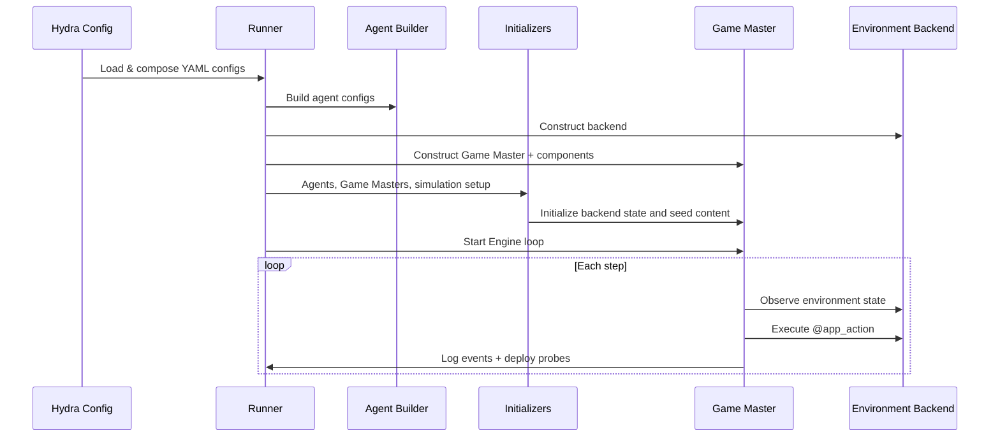

# Usage Overview

This guide covers the complete workflow for running Silisocs simulations —
from configuration to output analysis.

## How It Works

The simulation runs in four phases:



**Phase 1 — Config composition**: Hydra merges the base simulation config,
environment config, and world config into a single resolved config tree.

**Phase 2 — Agent construction**: The agent builder reads the persona pipeline
(or custom builder logic) and creates agent configs with personas, memories,
and goals. Runtime construction then creates live agents.

**Phase 3 — Runtime initialization**: The Engine runs agent initialization,
Game Master initialization, then simulation initialization before the main loop.

**Phase 4 — Simulation loop**: Each step, agents observe environment state,
decide on an action, and the game master executes it against the configured
backend. Each backend provides its own observations through the GM component
slots; `app_observation` delegates directly to `BackendApp.observe(...)`.
Probes are deployed on schedule.

---

## Running a Simulation

For multi-condition research orchestration (hypothesis trees, seed sweeps, and built-in evaluators), use [Experiment Studies](experiments.md).

### CLI (Recommended)

The primary entry point is the `silisocs` CLI command:

```sh
# Run with defaults
uv run silisocs

# Override parameters via Hydra
uv run silisocs num_agents=10 num_steps=5 sim.llm.name=gpt-4o

# Use a different backend
uv run silisocs env=reddit_like

# Run the packaged resource-market preset
uv run silisocs world=resource_market agents=resource_market env=resource_market

# Run the packaged virtual-space preset
uv run silisocs world=virtual_space agents=virtual_space env=virtual_space

# Run curated external backend examples
uv run silisocs --config-path scenarios/resource_market/conf world=resource_market agents=resource_market env=resource_market
uv run silisocs --config-path scenarios/virtual_space/conf world=virtual_space agents=virtual_space env=virtual_space

# Run an external scenario
uv run silisocs --config-path scenarios/election/conf
```

### Hydra CLI Overrides

Any config value can be overridden from the command line using dot notation:

```sh
uv run silisocs \
  num_agents=100 \
  num_steps=50 \
  seed=42 \
  env.gm.components.initialize.params.graph.network_type=random

# Switch GM resolve mode to tool-calling
uv run silisocs \
  env.gm.components.resolve.built_in=tool_calling \
  sim.tool_calling.mode=single

# Override only who can act next
uv run silisocs env.gm.components.next_acting.built_in=all_agents
```

### Dashboard

For a visual interface:

```sh
uv run streamlit run src/silisocs/dashboard/launch_app.py
```

The launcher sidebar loads configs in two steps: choose a scenario first, then
choose whether to start from the scenario definition or a prior run snapshot.

See [Dashboard](dashboard.md) for details.

---

## Configuration System

The project uses [Hydra](https://hydra.cc/) for hierarchical YAML configuration
with composition. The top-level package config is
`src/silisocs/conf/experiment.yaml` and composes these groups:

```yaml
# experiment.yaml
defaults:
  - world: default         # Root run params, setting, event, and world data
  - agents: default        # Agent construction and personas
  - sim: base              # Simulation parameters
  - env: twitter_like      # Backend and GM wiring
  - eval: base            # Probes and evaluation config
```

### Config Hierarchy

```
src/silisocs/conf/
├── experiment.yaml          # Top-level composition
├── agents/
│   └── default.yaml         # Persona pipeline defaults
├── world/
│   └── default.yaml         # Root run params and default world
├── sim/
│   └── base.yaml            # LLM, engine, tool-calling, memory, checkpoints
├── env/
│   ├── twitter_like.yaml    # Local Twitter-like backend
│   ├── reddit_like.yaml     # Local Reddit-like backend
│   └── mastodon.yaml        # Remote Mastodon server
└── eval/
    └── base.yaml            # Probe and logging defaults
```

See [Configuration Reference](configuration.md) for all options.

For environment-level customization (Engine + GM components + backends), see
[Environment Layer](environment_layer.md).

### External Scenarios

Scenarios can live outside the package in `scenarios/<name>/conf/`:

```
scenarios/election/
├── conf/
│   ├── world/default.yaml # @package _global_
│   ├── agents/default.yaml   # @package agents
│   ├── sim.yaml              # Optional partial sim override
│   ├── env.yaml              # Optional partial env override
│   └── eval.yaml            # Optional partial eval override
├── builders.py              # Optional importable custom agent builder
└── outputs/                 # Simulation output (auto-created)
```

Run with:

```sh
uv run silisocs --config-path scenarios/election/conf
```

The runner reads `scenario_name` from the world config automatically, so you
usually do not need a manual `world=` override.

---

## Agent Pipeline

Agents are defined in the `persona_pipeline` section of your scenario config.
There are two methods:

### Method 1: YAML Pipeline (Declarative)

Define agent classes with data sources and field mappings:

```yaml
builder:
  class_path: null
  params: {}

persona_pipeline:
  classes:
    user:
      count: 100
      class_path: silisocs.agents.native.NativeAgent
      data:
        source: inline
        records:
          - name: Alex
            persona: Alex is a local organizer who posts about public services.
      field_map:
        name: name
        context: persona
```

Hugging Face datasets are available with the `hf` extra:

```sh
pip install "silisocs[hf]"
```

```yaml
data:
  source: hf_dataset
  dataset: nvidia/Nemotron-Personas-USA
  split: train
```

### Method 2: Custom Builder (Programmatic)

Set `agents.builder.class_path` when you need programmatic agent-spec logic:

```python
from silisocs.runtime.construction.agent_builders import AgentBuilder
from silisocs.runtime.construction.specs import AgentConfig

class MyScenarioAgentBuilder(AgentBuilder):
    def build_agent_configs(self):
        return [AgentConfig(...) for _ in range(3)]
```

See [Building Agents](building_agents.md) for the full guide.

---

## Per-Agent LLM Models

You can assign different LLM models at three levels:

**Global default** — in `sim/base.yaml`:
```yaml
llm:
  provider: openai
  name: gpt-4o
```

**Per-class** — in the persona pipeline:
```yaml
classes:
  voter:
    count: 100
    model: gpt-4o-mini      # Cheaper model for voters
  candidate:
    count: 2
    model: gpt-4o            # Better model for key agents
```

**Per-agent** — via field mapping:
```yaml
classes:
  user:
    count: 50
    data:
      source: local_json
      path: agents.json       # Must have a "model" field per record
    field_map:
      name: name
      context: persona
      model: model_name       # Maps to per-agent model assignment
```

Priority: per-agent field_map > per-class config > global default.

---

## Social Graph And Activity

Graph fields feed the GM initialize component. Activity rates feed the GM
`next_acting` slot.

```yaml
gm:
  components:
    initialize:
      params:
        graph:
          network_type: barabasi_albert
          barabasi_albert_m: 10
          base_followership_probability: 0.3
          fully_connected_targets:
            - news_account
    next_acting:
      params:
        activity_transition_rates:
          user:
            inactive_to_active: 0.3
            active_to_inactive: 0.3
```

The activity model uses a two-state Markov process: each step, an agent
transitions between active and inactive states. Only active agents take actions.

---

## Fixed-Action Agents

Use `silisocs.agents.fixed.FixedAgent` when you want deterministic,
episode-aware behavior without LLM action generation.

Minimal pattern:

```yaml
persona_pipeline:
  classes:
    broadcaster:
      count: 1
      class_path: silisocs.agents.fixed.FixedAgent
      sim_role_name: broadcaster
      data:
        source: inline
        records:
          - context: Official broadcaster account
            name: Town Bulletin
      field_map:
        name: name
        context: context
      params:
        flow_tag: fixed_pre
        fixed_action_plan:
          0:
            - action_type: POST
              target_id: ""
              content: "Daily bulletin from {name}: please stay informed."
              reasoning: "Scheduled bulletin at simulation start."
          5:
            - action_type: POST
              target_id: ""
              content: "Emergency update from {name}: check local advisories."
              reasoning: "Scheduled follow-up bulletin."

sim:
  engine:
    step:
      built_in: flow
      params:
        flow_order: [fixed_pre, default]
  gm:
    components:
      observe:
        built_in: timeline_every_turn
        params:
          episode_observation_flows: [fixed_pre]
```

Behavior notes:

- Fixed agents parse episode index from observation text (for example `EPISODE: 12`).
- If no episode number is parseable, the fixed agent increments its internal counter by 1.
- The action text emitted by fixed agents is compatible with existing resolve components.
- `fixed_action_plan` is strict dict-only (`episode -> list[action]`), not list-based.
- You can load the same structure from a file using `params.fixed_action_plan_file` (`.json/.yaml/.yml`).

Compatibility notes:

- Fixed-action items use backend action names (or selectable aliases).
- `env.gm.backend.enabled_actions` and `env.gm.backend.excluded_actions` apply
  globally and can restrict fixed-action items.

---

## Memory Initialization

Before the simulation loop starts, the Engine runs agent initialization and
populates each agent's memory:

1. **Shared memories** (from config) are broadcast to all agents
2. **Generated memories** (from `generate_memories()`) are per-agent
3. **Specific memories** (per-agent, from config) are injected last

Two built-in modes:

| Mode | Config | Behavior |
|------|--------|----------|
| **Raw** | `sim.initialization.agents.built_in: raw_memory` | No LLM calls, only config memories |
| **Formative** | `sim.initialization.agents.built_in: formative_memory` | LLM-generated multi-episode backstories |

See [Memory Initialization](memory_initialization.md) for custom initializers.

---

## Evaluation Probes

Probes are periodic surveys deployed to agents during the simulation:

```yaml
probes:
  deployment:
    enabled: true
    start_step: 1
    every_n_steps: 5
  probes:
    satisfaction:
      probe_name: satisfaction
      probe_type: NumericRatingProbe
      probe_data:
        name: Satisfaction
        question: "On a scale of {lo} to {hi}, how satisfied are you?"
        lo: 1
        hi: 10
```

Built-in probe types: `NumericRatingProbe`, `BinaryProbe`, `ChoiceProbe`,
`FreeTextProbe`.

See [Evaluation Probes](probes.md) for details.

---

## Output

Each simulation run produces output under the Hydra-managed directory:

```
outputs/<scenario_name>/<jobname>/<jobname>_<timestamp>/
```

### Output Files

| File | Format | Description |
|------|--------|-------------|
| `action_events.jsonl` | JSONL | Every social media action (post, reply, like, repost, follow, etc.) with episode index, source user, and action data |
| `probe_events.jsonl` | JSONL | Probe/survey responses per agent per deployment step |
| `prompts_and_responses.jsonl` | JSONL | Every LLM call — prompt, response, episode index, and agent name |
| `run_stats.log` | Text | Per-episode timing, worker counts, retry telemetry, and startup phase durations |
| `sim_metrics.json` | JSON | Structured metrics summary: system info, per-episode durations, worker limits, resource snapshots (CPU/memory), and aggregate statistics |
| `<platform>.db` | SQLite | Full social media state (users, posts, replies, likes, follows). Use with the [built-in visualizers](backends.md#built-in-visualizers) to browse |
| `.hydra/config.yaml` | YAML | Fully resolved Hydra config snapshot |
| `.hydra/overrides.yaml` | YAML | CLI overrides used for this run |

### Action Events Format

Each line in `action_events.jsonl` is a JSON object:

```json
{
  "episode": 3,
  "event_type": "action",
  "event_index": 42,
  "source_user": "Alice Smith",
  "label": "post",
  "data": {
    "content": "Beautiful morning in the neighborhood!",
    "post_id": 127
  }
}
```

### Probe Events Format

Each line in `probe_events.jsonl`:

```json
{
  "episode": 5,
  "event_type": "probe",
  "event_index": 0,
  "data": {
    "agent": "Alice Smith",
    "probe_type": "NumericRatingProbe",
    "question": "Rate your satisfaction 1-10",
    "raw_response": "I'd say about a 7",
    "probe_return": "7"
  }
}
```

### Simulation Metrics

`sim_metrics.json` provides structured data for analysis:

```json
{
  "metadata": {
    "num_agents": 10,
    "num_steps": 5,
    "world": "election",
    "llm": {"name": "gpt-4o"},
    "agent_names": ["Alice Smith", "Bob Jones", "..."]
  },
  "total_duration_s": 1234.5,
  "episodes": [
    {
      "episode": 1,
      "duration_s": 6.2,
      "active_agents": 145,
      "worker_limit": 200,
      "retry_count": 3
    }
  ],
  "resources": {
    "start": {"cpu_percent": 12.5, "memory_mb": 1024},
    "end": {"cpu_percent": 45.2, "memory_mb": 3072}
  }
}
```

### Visualizing Output

Point the built-in visualizer at the SQLite database to browse the simulation
state interactively:

```sh
uv sync --extra viz

# Twitter-like
TWITTER_LIKE_DB=outputs/my_world/.../twitter_like.db \
  python -m silisocs.environments.backends.twitter_like.visualizer.server

# Reddit-like
REDDIT_LIKE_DB=outputs/my_world/.../reddit_like.db \
  python -m silisocs.environments.backends.reddit_like.visualizer.server
```

See [Environment Backends](backends.md#built-in-visualizers) for full details.

---

## End-to-End Workflow

Here is the complete workflow for creating and running a custom world:

### 1. Create the Scenario Directory

```sh
mkdir -p scenarios/my_world/conf/world scenarios/my_world/conf/agents
```

### 2. Write the Scenario Configs

```yaml
# scenarios/my_world/conf/world/default.yaml
# @package _global_
scenario_name: my_world
num_agents: 2
num_steps: 5

setting:
  name: My Community
  background:
    - A small online community focused on technology discussions.

event:
  name: Product launch
  context: |
    A new product has been announced and community members
    are discussing its merits and drawbacks.
```

```yaml
# scenarios/my_world/conf/agents/default.yaml
# @package agents
persona_pipeline:
  defaults:
    params:
      world_context: ${event.context}
    shared_memories:
      - They are active on a tech discussion forum.
      - ${event.context}
  classes:
    user:
      count: ${num_agents}
      class_path: silisocs.agents.native.NativeAgent
      sim_role_name: user
      data:
        source: inline
        records:
          - name: Alex
            persona: Alex follows product launches and asks practical questions.
          - name: Blair
            persona: Blair studies developer tools and compares alternatives.
      field_map:
        name: name
        context: persona

shared_memories:
  - They are active on a tech discussion forum.
  - ${event.context}

initial_observations:
  - "{name} is browsing the forum."
  - "{name} sees the latest announcement about the product launch."
```

```yaml
# scenarios/my_world/conf/env.yaml
gm:
  components:
    initialize:
      params:
        graph:
          network_type: barabasi_albert
          barabasi_albert_m: 10
          base_followership_probability: 0.3
    next_acting:
      params:
        activity_transition_rates:
          user:
            inactive_to_active: 0.3
            active_to_inactive: 0.3
```

### 3. Run It

```sh
uv run silisocs --config-path scenarios/my_world/conf num_agents=20 num_steps=10
```

### 4. Analyze Output

Output appears in `outputs/my_world/`.

### 5. (Optional) Add a Custom Builder

If you need programmatic control over agent construction:

```python
# scenarios/my_world/builders.py
from silisocs.runtime.construction.agent_builders import AgentBuilder

class MyScenarioAgentBuilder(AgentBuilder):
    def build_agent_configs(self):
        # Custom logic here
        ...
```

### 6. (Optional) Use the Dashboard

```sh
uv run streamlit run src/silisocs/dashboard/launch_app.py
```

Create the scenario visually, configure agents, and launch. Use the sidebar
`Start from` selector to load previous run configuration snapshots when needed.

To replay simulation state from a previous run, use `sim.checkpoint.source_run`
in the launch overrides.

### 7. Replay from a Checkpoint

Enable checkpointing during a run:

```sh
uv run silisocs \
  --config-path scenarios/my_world/conf \
  num_steps=200 \
  sim.checkpoint.every_n_steps=10
```

Then restore from the previous output directory:

```sh
uv run silisocs \
  --config-path scenarios/my_world/conf \
  num_steps=200 \
  sim.checkpoint.source_run=outputs/my_world/run1 \
  sim.checkpoint.restore.built_in=social_action_event_replay
```

Current checkpoints store default agent state, game-master component state, and
the state of built-in local backends. For SQLite-backed backends such as
`twitter_like` and `reddit_like`, the checkpoint stores a database snapshot. The
restore strategy is only used when checkpointed backend state is absent and a
domain-specific replay is needed.

---

## Developer Customization Guide

This section maps key runtime tasks to concrete extension points for developer
users.

### Engine Responsibilities

The runtime now includes direct engine step strategies:

- `sim.engine.step.built_in: base` (default): simple execution path, one GM active per episode.
- `sim.engine.step.built_in: sequential`: one GM, selected agents executed one by one.
- `sim.engine.step.built_in: flow`: flow-aware execution.
- `sim.engine.step.built_in: multi_gm`: flow-aware execution with multi-GM routing.

The engine is responsible for:

- Episode loop orchestration (`run_loop`)
- Probe scheduling and deployment timing
- Selecting acting agents and action specs for each episode
- Running agent actions concurrently and resolving them through the GM
- Worker throttling based on retry telemetry

Key implementation: `src/silisocs/simulation_engines/base_engines.py`.

#### Current Action Semantics

Action semantics are policy-driven through `sim.engine.turn_policy`.

- `single_action`: one resolved action per acting agent per episode.
- `fixed_count`: a fixed number of resolved actions per acting agent.
- `open_ended`: continue until stop token or max action budget.

Built-in turn policies also accept `observe_before_act: first | always | never`.
The default `first` preserves existing behavior by observing before the first
action in a repeated-action turn.

Probe timing is policy-driven through `eval.probes.schedule`.

#### Defining New Agent Behavior Flows

To introduce new class-level behavior phases without engine/resolve bloat:

1. Set `flow_tag` per class in `persona_pipeline.classes`.
2. Define phase order in `sim.engine.step.params.flow_order`.
3. Optionally add per-agent overrides with `sim.engine.step.params.agent_to_flow`.
4. Add any flow names that require episode-style observations to
  `env.gm.components.observe.params.episode_observation_flows`.

This pattern is how fixed agents run before default LLM-driven agents today,
and it generalizes to any future specialized class.

### Game Master Responsibilities

The environment GM (`GameMaster` + native components) is responsible for:

- Initializing the active backend app through its initialize component
- Building generic or timeline observations for each acting agent
- Parsing and dispatching actions (`custom`, `generic`) and tool calls (`none`, `single`, `multi`)
- Applying action effects through the backend app contract
- Managing activity-state-based actor gating

Key implementations:

- `src/silisocs/environments/gm/game_master.py`
- `src/silisocs/environments/gm/components/`

### What Developers Commonly Customize

#### Engine-side tasks

- Multi-action-per-episode turn policy (`sim.engine.turn_policy`)
- Alternative actor scheduling policies
- Probe timing policy (`eval.probes.schedule`)
- Concurrency and retry throttling strategy

#### GM-side tasks

- Action grammar and parsing through resolve components
- Action dispatch strategy by resolve mode (`parsed_action`, `generic_action`, `tool_calling`)
- Observation shaping (`app_observation`, `timeline_every_turn`, or custom component)
- Activity transition behavior through next-acting components
- Seed posts through simulation initialization, then normal `resolve_action`

### Backend Contract Tasks

For platform extensions, backend classes implement `BackendApp` and are
selected by `env.gm.backend.type` or `env.gm.backend.class_path` through the backend factory.
Typical developer tasks include adding new `@app_action` methods, observations,
optional timeline semantics, and storage/query behavior.

---

## Further Reading

- [Configuration Reference](configuration.md) — Every config option explained
- [Building Agents](building_agents.md) — YAML pipeline and custom builders
- [Memory Initialization](memory_initialization.md) — Raw, formative, and custom modes
- [Environment Backends](backends.md) — Generic apps, Twitter-like, Reddit-like, Mastodon
- [Evaluation Probes](probes.md) — Probe types and deployment
- [Dashboard](dashboard.md) — Streamlit GUI guide
- [Election Walkthrough](tutorials/election.md) — Complex real-world example
